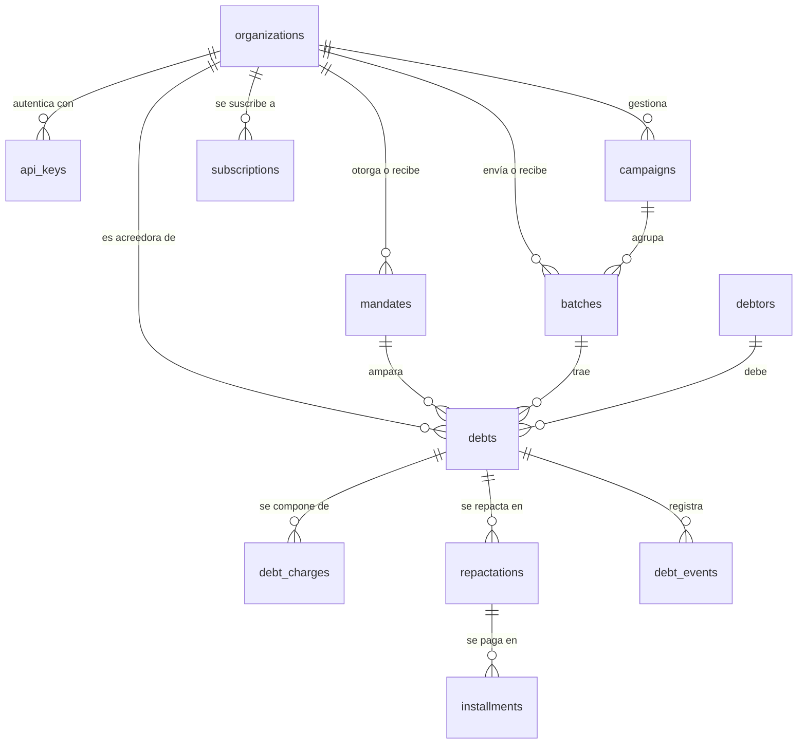
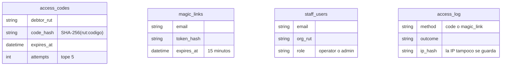
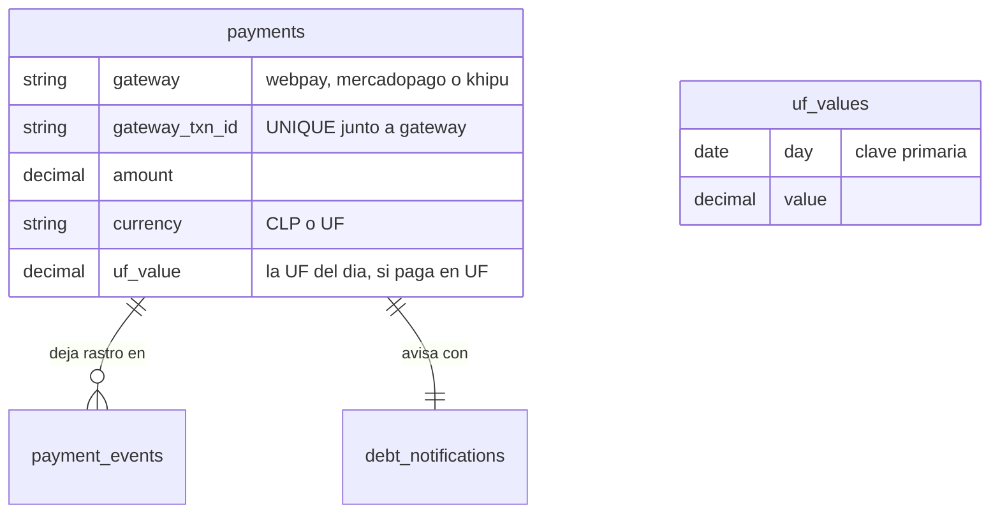
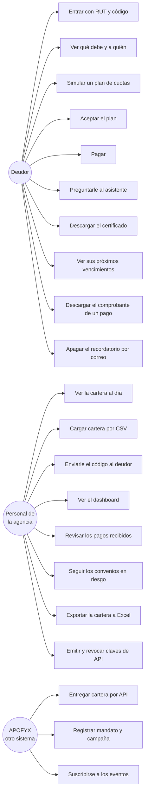
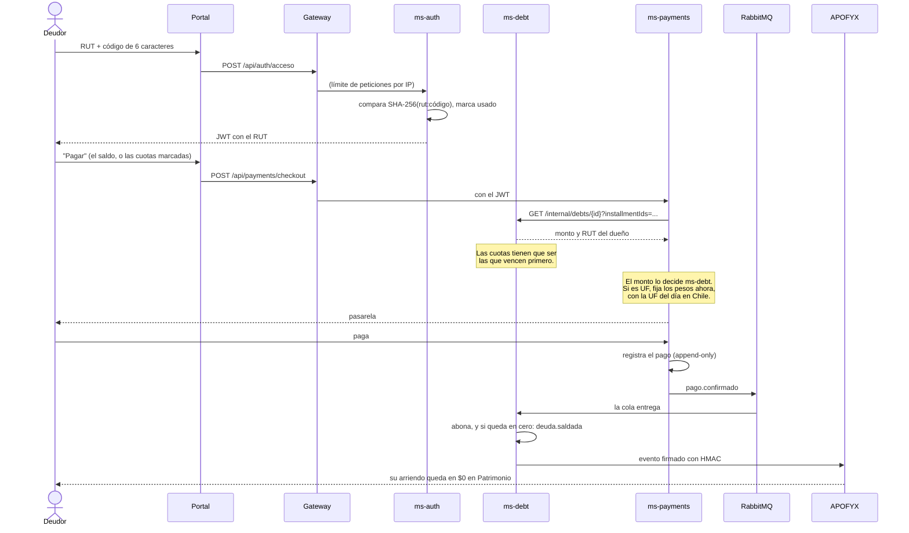

# Technical Bridge — DataBridge

[](https://github.com/TechnicalBridge/TB_web/actions/workflows/ci.yml)

Plataforma de pago y repactación de deudas. Proyecto de Capstone; las empresas, las personas y
los RUT son ficticios.

**Todo el sistema se levanta con una orden** y queda en http://localhost:8080 — no hace falta
tener instalado JDK, Node ni Python, solo Docker:

```powershell
docker compose --profile app up -d --wait
```

| | |
| --- | --- |
| [1. Descripción](#1-descripción) | [2. Tecnologías](#2-tecnologías-utilizadas) · [3. Cómo ejecutarlo](#3-cómo-ejecutar-el-proyecto-localmente) · [4. Equipo](#4-integrantes-del-equipo) |
| [5. Metodología](#5-metodología-de-trabajo) | [6. Arquitectura](#6-arquitectura-de-la-solución) · [7. Modelo de datos](#7-modelo-de-datos) · [8. Diagramas UML](#8-diagramas-uml) |
| [9. Requisitos no funcionales](#9-requisitos-no-funcionales) | [10. Docker](#10-docker) · [11. Pruebas](#11-pruebas) · [12. Innovación](#12-innovación) |

---

## 1. Descripción

### Qué hace

DataBridge es donde **el deudor moroso paga**. Entra con su RUT y un código de seis caracteres
que le llegó por correo o WhatsApp —sin cuenta, sin contraseña—, ve exactamente qué debe y a
quién, y puede pagarlo de una vez o repactarlo en 3 a 24 cuotas sin interés. En convenio, paga
una cuota o varias a la vez, siempre desde la que vence primero. Una barra le muestra en qué va
cada deuda: **pendiente → en convenio → pago conciliado**. Si tiene dudas, le pregunta a un
asistente que lee su deuda con su propia sesión. Cuando termina de pagar, descarga su certificado
de deuda cero.

Adentro tiene también sus **próximos vencimientos**, que puede pasar al calendario del teléfono;
su **historial de pagos**, con un comprobante en PDF de cada uno; un **recordatorio por correo**
unos días antes de cada cuota, que no lleva monto ni enlace, y **sus datos**, donde apaga ese
recordatorio si no lo quiere.

**El alcance son los deudores morosos.** Una deuda entra a cobranza con al menos **dos meses
impagos** (`MIN_MESES_IMPAGOS`); con menos todavía no es mora, y se rechaza sola al recibir la
cartera con el código `bajo_umbral_mora`. Se cuentan meses, no cargos: el arriendo y el gasto
común de septiembre son un solo mes.

Del otro lado, la empresa que gestiona la cartera la ve al día, carga deudas nuevas por API o
arrastrando un CSV, le envía el código al deudor y mira en un panel cuánto se ha recuperado.
Revisa los pagos que entraron, filtrados por medio de pago; sigue los **convenios en riesgo**,
los que tienen una cuota vencida; exporta la cartera a Excel, y emite y revoca sus propias
claves de API.

### A quién va dirigido

| Quién | Qué hace acá |
| --- | --- |
| **La persona que debe** | Entra, mira, repacta y paga. Es quien usa el portal de verdad |
| **La agencia de cobranza** (APOFYX) | Entrega la cartera, envía los códigos y sigue la recuperación |
| **El acreedor** (Patrimonio Inmuebles) | No entra nunca: recibe el aviso de cada pago en su propio sistema |

### Qué problema resuelve

Cobrar deudas chicas cuesta más que la deuda. Una llamada a alguien que debe $40.000 se come el
margen, así que a esa persona nadie la llama: le mandan cartas, la mandan a DICOM y la deuda
envejece hasta que se castiga.

Y del otro lado está el problema espejo, que es el que casi nadie mira: **el deudor que sí quiere
pagar no puede**. Tiene que llamar en horario de oficina, esperar, dar sus datos y que alguien le
diga cuánto debe. DataBridge saca a la persona del medio en los dos sentidos: el deudor paga solo
a las 11 de la noche si quiere, y el acreedor se entera sin que nadie escriba un correo.

---

## 2. Tecnologías utilizadas

| Capa | Tecnología | Por qué |
| --- | --- | --- |
| **Lenguajes** | Java 25, JavaScript (ES2022), Python 3.13 | |
| **Backend** | Spring Boot 3.5 · Spring Cloud Gateway · Spring Security · Spring Data JPA · Bean Validation | Cuatro microservicios independientes |
| **API** | springdoc-openapi (Swagger) · Spring HATEOAS · Spring Boot Actuator | Documentación de todos los endpoints en una página; respuestas que dicen qué se puede hacer después; salud para Docker |
| **Asistente** | FastAPI + Uvicorn | El único servicio que no es de Spring: la librería de lenguaje natural vive en Python |
| **Frontend** | React 18 · React Router 7 · Vite · Zustand · Recharts · CSS propio | |
| **Base de datos** | **MySQL 8.4**, una por servicio | El mismo motor que usa APOFYX, para no tener dos en el proyecto |
| **Migraciones** | Flyway, con `ddl-auto: validate` | El esquema se versiona; Hibernate no lo cambia a espaldas de nadie |
| **Mensajería** | RabbitMQ 3.13 | Lleva el aviso de pago entre servicios |
| **Autenticación** | JWT (JJWT) · códigos de un solo uso | Sin contraseñas |
| **Contenedores** | Docker · Docker Compose | Nueve contenedores, una orden |
| **Pruebas** | JUnit 5 · Mockito · MockMvc · k6 | Unitarias, de la capa web y de rendimiento |
| **Integración continua** | GitHub Actions | Corre las pruebas en cada push |
| **Servidor web** | nginx (sin privilegios) | Sirve el portal compilado y hace de proxy al gateway |
| **Correo** | Mailpit | Buzón de prueba: recibe los códigos sin mandárselos a nadie |

**Nube:** ninguna. El sistema corre entero en contenedores, así que puede desplegarse en
cualquier proveedor que acepte Docker, pero **hoy no depende de ningún servicio administrado**.
La única dependencia externa es la API del Banco Central para el valor de la UF, y es opcional.

---

## 3. Cómo ejecutar el proyecto localmente

### La forma corta: todo en Docker

Lo único que hace falta es **Docker Desktop** corriendo.

```powershell
git clone https://github.com/TechnicalBridge/TB_web.git
cd TB_web
docker compose --profile app up -d --build --wait
```

Levanta el backend y el portal **a la par**. `--wait` devuelve el control recién cuando los
nueve contenedores están **sanos**, no cuando arrancaron. La primera vez demora unos minutos
porque compila; después son segundos.

| | |
| --- | --- |
| **Portal** | http://localhost:8080 |
| **Documentación de la API (Swagger)** | http://localhost:8080/swagger-ui.html |
| Buzón de prueba (los códigos llegan acá) | http://localhost:8025 |
| RabbitMQ | http://localhost:15672 · `guest` / `guest` |
| Base de datos | `127.0.0.1:3308` · `tbridge` / `tbridge_pass` |

Para apagar: `docker compose --profile app down`. Con `-v` borra además los datos.

### Para entrar como deudor

El sistema arranca con la cartera de ejemplo de Patrimonio Inmuebles, con cada deudor en una
situación distinta. Es la misma historia que cargan Patrimonio y APOFYX en sus propios datos de
ejemplo, así que los tres sistemas cuentan lo mismo:

| RUT | Deudor | Situación |
| --- | --- | --- |
| 16.482.337-7 | Felipe Rojas Muñoz | En convenio de 6 cuotas, con 3 pagadas |
| 76.991.245-2 | Comercial Ñandú SpA | Debe tres meses en UF |
| 14.583.206-3 | Rodrigo Pérez Contreras | Debe cuatro meses |
| 76.284.519-9 | Panadería La Espiga Ltda. | En convenio en UF, con la primera cuota pagada en pesos |
| 17.893.456-2 | Ignacio Tapia Rojas | En convenio, con la primera cuota vencida: es el *convenio en riesgo* |
| 19.230.418-0 | Carolina Muñoz Vera | Pagó todo de una vez, con Khipu |
| 18.642.975-3 | Daniela Cáceres Flores | Pagó sus tres cuotas juntas |
| 15.227.640-0 | Tomás Fuentes Leiva | Pagó en la oficina de Patrimonio, que retiró la deuda |

Para conseguir un código:

```powershell
$cuerpo = @{ rut = "16482337-7"; canales = @("correo"); correo = "felipe.rojas@correo.cl"
             acreedor = "Patrimonio Inmuebles"; paraQue = "CTR-2025-014" } | ConvertTo-Json -Compress
$cuerpo | docker compose exec -T ms-auth curl -s -X POST http://127.0.0.1:8081/internal/codigos `
  -H "X-Internal-Key: tbridge-internal-dev" -H "Content-Type: application/json" --data-binary "@-"
```

Responde con el `codigo`. Con él se entra al portal en **Tengo un código de acceso**, con el
RUT `16.482.337-7`. El código sirve **una sola vez** y dura 24 horas. También llega al buzón de
prueba.

> El JSON va por la entrada estándar (`--data-binary "@-"`) y no como argumento a propósito:
> PowerShell 5.1 parte en dos un argumento que trae comillas y espacios, y `curl` recibía medio
> JSON.

> Se pide desde dentro del contenedor a propósito: los endpoints internos **no** están
> publicados hacia afuera. Ver [§9](#9-requisitos-no-funcionales).

### Para programar

Con las imágenes no se programa: recompilar en cada cambio sería insoportable. Se levanta la
infraestructura en Docker y los servicios en la máquina.

Hace falta **Docker Desktop**, un **JDK 25** (no un JRE: Maven compila), **Node 22+** y
**Python 3.13+**. Si `JAVA_HOME` apunta a otro Java, se corrige en cada terminal:
`$env:JAVA_HOME = "C:\Program Files\Java\jdk-25"`.

```powershell
docker compose up -d                 # solo MySQL, RabbitMQ y el buzón
.\mvnw.cmd -q install -DskipTests    # compila todo y deja common instalado para los servicios
```

Después, **una terminal por pieza**. El perfil `dev` muestra el SQL y el detalle de cada ruta:

```powershell
.\mvnw.cmd -pl ms-auth spring-boot:run "-Dspring-boot.run.profiles=dev"
.\mvnw.cmd -pl ms-debt spring-boot:run "-Dspring-boot.run.profiles=dev"
.\mvnw.cmd -pl ms-payments spring-boot:run "-Dspring-boot.run.profiles=dev"
.\mvnw.cmd -pl gateway spring-boot:run "-Dspring-boot.run.profiles=dev"
```

```powershell
cd ms-ai
python -m venv .venv
.venv\Scripts\python.exe -m pip install -r requirements.txt
.venv\Scripts\python.exe -m uvicorn app.main:app --port 8085
```

```powershell
cd frontend
npm install
npm run dev
```

El portal queda en http://localhost:5173, servido por Vite con recarga automática, y Swagger en
http://localhost:5173/swagger-ui.html. Si cambias algo en `common`, vuelve a correr el `install`:
los servicios usan la copia instalada, no el código.

---

## 4. Integrantes del equipo

> **⚠ POR COMPLETAR ANTES DE ENTREGAR.** El equipo tiene que llenar la columna de rol.

| Integrante | Rol |
| --- | --- |
| Pedro Campos | |
| Martín Gutiérrez | |
| Flavio Henríquez | |
| Esteban Maino | |

---

## 5. Metodología de trabajo

**Kanban**, con prácticas de **DevOps** para la entrega.

El trabajo se organizó en un tablero Kanban dividido en cinco épicas —autenticación, gestión de
deudas, pagos, asistente, y reportes— con un backlog de tareas que se fueron tomando de a una.
El seguimiento tarea por tarea, con dónde quedó cada una y **en qué nos apartamos del plan
original y por qué**, está en [`docs/plan-kanban.md`](docs/plan-kanban.md).

De DevOps se tomaron tres cosas, no por moda sino porque resolvían un problema concreto:

| Práctica | Qué resuelve |
| --- | --- |
| **Integración continua** (GitHub Actions) | Las pruebas corren en cada push, en un equipo limpio. Lo que funciona "en mi máquina" no cuenta |
| **Infraestructura como código** (Docker Compose) | Levantar el sistema es una orden y no una página de instrucciones que alguien sigue mal |
| **Esquema versionado** (Flyway) | Cambiar la base es un archivo con número, revisable, no un `ALTER TABLE` que alguien corrió una vez |

---

## 6. Arquitectura de la solución

Cinco servicios detrás de una sola puerta. El navegador solo habla con el portal; el portal manda
todo lo que empiece con `/api` al **gateway**, y el gateway decide a qué servicio le toca. Ningún
servicio queda expuesto hacia afuera.


### Los componentes

| Pieza | Qué hace |
| --- | --- |
| **portal** | React con Zustand y CSS propio. En producción se compila y lo sirve nginx, que además hace de proxy hacia el gateway: el navegador ve un solo origen y no hay CORS que resolver |
| **gateway** | La única puerta. CORS, límite de peticiones con Bucket4j y enrutamiento. Lo que no pasa por aquí, no entra |
| **ms-auth** | Código de acceso (RUT + 6 caracteres, un solo uso, 24 h) y enlace de respaldo por correo, que es también como entra el personal de las empresas. Emite el JWT y manda los correos, incluido el recordatorio de cuota |
| **ms-debt** | Deudas, cargos y cuotas; simulación y aceptación de planes (3 a 24 meses, sin interés); ingesta de la cartera v1 por API o CSV; eventos de vuelta a quien entregó la cartera; resumen para el dashboard; certificado de deuda pagada y comprobante de cada pago, en PDF; recordatorio de las cuotas por vencer; claves de API de cada empresa |
| **ms-payments** | Cobros con Webpay, Mercado Pago y Khipu simulados. El monto lo decide ms-debt, nunca el navegador. En UF fija los pesos al abrir el cobro |
| **ms-ai** | Asistente de solo lectura (Python/FastAPI). Lee las deudas con la sesión del deudor, nunca con acceso propio a la base, y detecta frustración o desconfianza para ajustar el tono. Usa un LLM si hay `XAI_API_KEY`; si no, reglas |
| **MySQL 8.4** | Una base por servicio, con esquema versionado en Flyway ([`db/README.md`](db/README.md)) |
| **RabbitMQ** | Lleva el aviso de pago de ms-payments a ms-debt. Si está apagado, el mismo aviso va por HTTP; en los dos casos sale de una bandeja con reintentos, así que no se pierde |

### Cómo está organizado cada servicio

Los tres servicios con base de datos tienen la misma forma, así que quien conoce uno se ubica en
los otros:

```
com/tbridge/<servicio>/
├── config/        seguridad, Swagger (OpenApiConfig), RabbitMQ, datos de ejemplo
├── controller/    los endpoints: traducen HTTP y delegan, sin reglas de negocio
├── service/       las reglas de negocio
├── repository/    el acceso a la base (Spring Data JPA)
├── model/         las entidades, una por tabla
├── dto/request/   lo que entra, validado con Bean Validation
├── dto/response/  lo que sale, documentado para Swagger
├── assembler/     los enlaces de HATEOAS de cada recurso
├── client/        las llamadas a otros sistemas (otro servicio, el Banco Central)
└── exception/     los errores propios del servicio
```

`common` es la librería que comparten: el JWT, el manejo de errores (todos responden
`{"error": "..."}` con el código que corresponde) y el RUT. El gateway no tiene base: solo
`config/` (las rutas) y `filter/` (el límite de peticiones).

**Swagger.** Cada servicio documenta sus endpoints en tres grupos según quién los llama —el
**portal**, el **contrato de integración** y lo **interno**— y el gateway los junta en una sola
página: http://localhost:8080/swagger-ui.html. El botón *Authorize* recibe el JWT del portal, la
clave de API del contrato o la clave interna.

**HATEOAS.** Las respuestas del portal traen `_links` con lo que se puede hacer después, según el
estado y quién mira: una deuda pendiente le ofrece al deudor `simular`, `repactar` y `pagar`; a la
empresa, `enviar-codigo`; una deuda pagada, el `certificado`; un pago, su `comprobante`; una
clave de API vigente, `revocar`. Las listas vienen en
`_embedded` (`_embedded.debts`). Los enlaces salen con la dirección pública
(`http://localhost:8080/...`), no con la del contenedor, porque cada servicio lee las cabeceras
`X-Forwarded-*` que le pasa el gateway. El contrato `/api/v1` no lleva enlaces: su forma está
publicada y la leen sistemas de otras empresas.

**Configuración.** Cada servicio tiene `application.properties` (todo con
`${VARIABLE:valor por omisión}`), `application-dev.properties` para programar y
`application-test.properties` para las pruebas. RabbitMQ se enciende con `EVENTS_RABBIT=true`, y
de esa sola propiedad dependen la cola, el listener y su indicador de salud.

### Comunicación entre servicios

Tres formas, y cada una está donde está por una razón:

| Entre quiénes | Cómo | Por qué así |
| --- | --- | --- |
| Navegador → servicios | HTTP por el gateway, con JWT | Una sola puerta que revisar |
| Sistemas de las agencias → ms-debt | HTTP por el gateway (`/api/v1`), con clave de API | Entran por la misma puerta, con su límite de peticiones |
| ms-payments → ms-debt | **RabbitMQ**, cola `ms-debt.pagos-confirmados` | El pago ya ocurrió: si ms-debt está caído, el aviso espera en la cola en vez de perderse |
| ms-debt → ms-auth, ms-payments → ms-debt | HTTP interno con `X-Internal-Key`, fuera del gateway | Son llamadas entre servicios, no de usuarios. El gateway no las expone |
| APOFYX ↔ DataBridge | HTTP con clave de API, y eventos firmados con HMAC-SHA256 | Son empresas distintas: ninguna entra en la base de la otra |

```
Contrato v1, de sistema a sistema (con clave de API):
  APOFYX ── POST /api/v1/carteras, /mandatos, /campanas, /suscripciones ──► ms-debt
  ms-debt ── eventos firmados (pago.confirmado, deuda.saldada, ...) ──────► APOFYX

Entre servicios (clave interna, no expuesto por el gateway):
  ms-payments ── /internal/events/pago-confirmado ──► ms-debt
  ms-debt ───── /internal/codigos ──────────────────► ms-auth   (el código y el recordatorio de cuota)
```

El contrato completo, con sus ejemplos y su esquema JSON, está en
[`docs/integracion/`](docs/integracion/README.md).

---

## 7. Modelo de datos

**Una base por servicio**, las tres en el mismo MySQL 8.4. No comparten tablas: si ms-payments
necesita saber cuánto se debe, se lo **pregunta** a ms-debt, no lo lee de su base. Eso permite
que cada servicio cambie su esquema sin romper a los demás, e impide que un error en pagos
corrompa la cartera.

El esquema lo versiona **Flyway**: cada servicio trae su `V1__esquema_inicial.sql` y arranca con
`ddl-auto: validate`, que compara las entidades con las tablas y se niega a partir si no calzan.

### `tb_debt` — la cartera



Trece tablas y dos vistas (`v_debt_balance`, `v_creditor_portfolio`). Lo que conviene mirar:

- **`organizations`** guarda tanto a la inmobiliaria como a la agencia de cobranza, con un `kind`
  que dice cuál es cuál. Un `mandates` las une: *esta agencia cobra por cuenta de este acreedor,
  desde esta fecha*. Sin mandato vigente, una cartera se rechaza.
- **El saldo no se guarda, se calcula.** `debts` tiene sus `debt_charges` y los pagos se anotan
  aparte; el saldo sale de la vista. Así no hay dos números que puedan discrepar.
- **`outbox`** es la bandeja de salida de los eventos, escrita en la misma transacción que el
  hecho que los provoca. Si el sistema se cae entre "cobré" y "avisé", el aviso sigue ahí.

### `tb_auth` — quién entra



Cuatro tablas sin relaciones entre sí, y es a propósito: **no hay tabla de usuarios deudores**.
El deudor no tiene cuenta. Se guarda el hash del código, nunca el código; y en `access_log` el
hash de la IP, nunca la IP.

### `tb_payments` — la plata



`payments` es **append-only**: un pago no se edita, se le agregan eventos. `UNIQUE (gateway,
gateway_txn_id)` impide cobrar dos veces la misma transacción aunque la pasarela repita el aviso.

---

## 8. Diagramas UML

### Casos de uso



El certificado (`U7`) solo se emite si la deuda está **pagada**: una deuda retirada por el
acreedor también queda en saldo cero, y certificar eso sería decir algo falso.

### Secuencia: el pago, que es la funcionalidad principal



Lo que este diagrama muestra y conviene notar: **el navegador nunca dice cuánto hay que pagar**.
Lo pregunta ms-payments a ms-debt. Y el aviso de vuelta no viaja por el navegador tampoco.

### Componentes

El diagrama de componentes es el de [§6](#6-arquitectura-de-la-solución): cada servicio es un
componente con su interfaz HTTP, su base propia y sus dependencias dibujadas.

---

## 9. Requisitos no funcionales

| Requisito | Cómo se cumple | Dónde está |
| --- | --- | --- |
| **Seguridad** · autenticación | El deudor entra con RUT + 6 caracteres, sin cuenta ni contraseña. Un solo uso, 24 h, 5 intentos. El alfabeto excluye `0 O 1 I L` porque el código se dicta por teléfono | `ms-auth/AuthService` |
| **Seguridad** · sesión | El JWT dura **15 minutos** y vive en la memoria de la pestaña, no en `localStorage`. Lo que mantiene a alguien adentro es una llave de renovación de 256 bits en una cookie `HttpOnly`, `SameSite=Strict` y limitada a `/api/auth`, que ningún script de la página puede leer. Cada uso la cambia por otra; cerrar sesión la revoca **en el servidor**; y si una llave ya usada vuelve a aparecer —alguien la copió— se revoca toda la sesión | `ms-auth/SessionService`, `V2__sesiones.sql` |
| **Seguridad** · origen | Cada freno cuenta por IP, así que la IP no se puede inventar: nginx sobrescribe `X-Forwarded-For` con la que vio, y el gateway solo le cree a sus proxies de confianza (`TRUSTED_PROXIES`). CORS acepta solo los orígenes del portal (`CORS_ORIGINS`), no `*` | `frontend/nginx.conf`, `gateway/ClienteReal` |
| **Seguridad** · secretos | Solo se guardan hashes: `SHA-256(rut:código)`, del token del enlace, de la clave de API y de la IP. Nada reversible | `V1__esquema_inicial.sql` |
| **Seguridad** · enumeración | "No hay código" y "código incorrecto" responden **lo mismo**, para que nadie pueda averiguar qué RUT tienen deuda | `AuthService.entrarConCodigo` |
| **Seguridad** · autorización | Cada sesión se identifica por RUT. Un deudor ve y paga solo lo suyo; una agencia ve solo la cartera que le corresponde por mandato | `DebtService.acreedorDe` |
| **Seguridad** · integridad | Los eventos van firmados con HMAC-SHA256, caducan a los 5 minutos y se descartan si llegan repetidos | `docs/integracion/README.md` §8 |
| **Seguridad** · superficie | De la aplicación, **solo el portal publica un puerto**. Comprobado: `curl` a 8081, 8083, 8084 y 8085 desde la máquina no obtiene respuesta. MySQL, RabbitMQ y el buzón sí publican, **a propósito**, para revisarlos en desarrollo; en un despliegue real esas tres líneas `ports:` se borran | `docker-compose.yml` |
| **Seguridad** · contenedores | Ninguna imagen corre como root: los servicios usan el usuario `10001` y el portal la nginx sin privilegios, que escucha en el 8080 porque un proceso sin privilegios no puede tomar el 80. Las imágenes de Java llevan solo el JRE, sin compilador ni código fuente | `*/Dockerfile` |
| **Seguridad** · entradas | Cada petición del portal entra como un tipo con sus reglas (`@NotBlank`, `@Min`, `@Pattern`...), y lo que no cumple se responde con `400` y un mensaje para la persona, antes de llegar a la lógica. Un JSON mal escrito o una ruta que no existe responden `400` y `404`, no `500` | `dto/request/`, `common/ApiExceptionHandler` |
| **Rendimiento** · medido | Con 100 personas a la vez, **cero errores** en unas 32.000 peticiones y un p95 de 7 a 12 ms según el día (11,8 ms el 24-09). Comparada lado a lado con la versión anterior, la refactorización a DTOs y HATEOAS no cambió la latencia de los servicios; el gateway suma unos 0,3 ms. En estrés, holgado hasta 1.000 peticiones por segundo, empieza a doler hacia las 1.500 y **toca techo en unas 1.800**, donde se pone lento pero sigue sin fallar. Detalle y máquina en [`rendimiento/`](rendimiento/README.md) | `rendimiento/` |
| **Rendimiento** · límite de peticiones | Dos capas: el gateway deja 10 por minuto en `/api/auth/**` y 120 globales por IP, y `ms-auth` bloquea diez minutos al origen que falla diez códigos. **Medido:** el gateway corta en la petición 11, se recarga solo, y lo que pasa lo frena `ms-auth` | `gateway/RateLimitFilter`, `AuthService` |
| **Rendimiento** · consultas | Trece índices en `tb_debt` para los caminos que se usan: `ix_debt_creditor_status` (la cartera de un acreedor), `ix_debt_debtor` (lo que debe una persona), `ix_batch_creditor`. Los `UNIQUE` hacen doble trabajo: `uq_payment_gateway` evita cobrar dos veces la misma transacción y además es el índice con que se busca | `V1__esquema_inicial.sql` |
| **Rendimiento** · memoria | La JVM lee el límite del contenedor (`MaxRAMPercentage=75`), no el de la máquina, y cada servicio tiene su tope declarado | `*/Dockerfile` |
| **Rendimiento** · portal | La página de la empresa, que trae los gráficos, se descarga solo al entrar a ella: el deudor baja 264 kB en vez de 685 kB | `frontend/src/App.jsx` |
| **Rendimiento** · simulador | El deslizador del plazo consulta el plan cuando lleva un segundo quieto, y guarda cada plazo ya calculado. Antes cada paso era una consulta: deslizarlo de punta a punta mandaba 18 seguidas y el gateway lo cortaba con "Demasiadas solicitudes". **Medido:** de 7 a 24 meses, una sola consulta; volver a un plazo ya visto, ninguna | `frontend/src/pages/Repact.jsx` |
| **Usabilidad** | Tema claro (crema y verde bosque) y oscuro (negro carbón y morado): sigue al del sistema hasta que la persona elige uno, y lo recuerda. Quien pidió menos movimiento al sistema no ve animaciones. La barra de estado se anuncia como barra de progreso a los lectores de pantalla | `frontend/src/index.css`, `store/temaStore.js` |
| **Escalabilidad** | Ningún servicio guarda sesión: la identidad viaja en el JWT, así que `docker compose up --scale gateway=3` funciona sin más. Cada servicio tiene su base y el trabajo pesado va por colas. **Límite conocido:** ms-debt y ms-payments tienen tareas programadas (`EventDispatcher`, `CampanaAvanceService`, `NotificationDispatcher`, `UfLoader`) que correrían en cada copia y harían el trabajo dos veces; replicarlos exige coordinarlas primero. Replicables hoy: gateway, ms-ai y portal | |
| **Disponibilidad** | Los nueve contenedores declaran `healthcheck` y ninguno arranca antes que aquel del que depende. La salud de los servicios la da Actuator (`/actuator/health`), que incluye la conexión a la base: un servicio sin base no se declara sano. `restart: unless-stopped` los repone si se caen | `docker-compose.yml` |
| **Disponibilidad** · entrega | Todo lo que sale hacia otro sistema pasa por una bandeja con reintentos (1 min, 5 min, 30 min, 2 h, 6 h, 24 h). Si DataBridge está caído, APOFYX sigue recibiendo carteras y lo pendiente se entrega solo cuando vuelve | `outbox`, `NotificationDispatcherTest` |
| **Portabilidad** | Una orden levanta el sistema entero en cualquier máquina con Docker, sin instalar JDK, Node ni Python | `docker-compose.yml` |
| **Mantenibilidad** | Los tres servicios tienen la misma estructura de paquetes ([§6](#cómo-está-organizado-cada-servicio)). `ddl-auto: validate` se niega a arrancar si las entidades y las tablas no calzan; Flyway versiona cada cambio de esquema | `application.properties` |
| **Documentación** | Todos los endpoints en Swagger, con sus respuestas posibles y ejemplos reales (RUT válidos, montos en CLP y UF) | http://localhost:8080/swagger-ui.html |

> **Límites conocidos.** El gateway guarda un contador por cada IP que ve y no lo olvida nunca:
> con clientes reales eso es poco, pero en un despliegue largo convendría que expiraran. Y las
> pruebas de carga miden lectura sobre una cartera pequeña, en una sola máquina: no dicen cómo se
> comporta la escritura ni una tabla con cien mil deudas.

---

## 10. Docker

### Qué se construye

| Imagen | Con qué | Tamaño |
| --- | --- | --- |
| `tbridge/ms-auth` · `tbridge/ms-debt` · `tbridge/ms-payments` · `tbridge/gateway` | Uno por servicio: [`ms-auth/Dockerfile`](ms-auth/Dockerfile), [`ms-debt/Dockerfile`](ms-debt/Dockerfile), [`ms-payments/Dockerfile`](ms-payments/Dockerfile), [`gateway/Dockerfile`](gateway/Dockerfile) | 563 – 616 MB |
| `tbridge/ms-ai` | [`ms-ai/Dockerfile`](ms-ai/Dockerfile) | 280 MB |
| `tbridge/portal` | [`frontend/Dockerfile`](frontend/Dockerfile), compila con Node y sirve con nginx | 83 MB |

Cada servicio de Java tiene **su propio Dockerfile** y compila solo lo suyo
(`mvn -pl <servicio> -am`: el servicio y `common`). Se construyen desde la raíz de TB_web porque
necesitan el `pom.xml` padre:

```powershell
docker build -f ms-debt/Dockerfile -t tbridge/ms-debt .
```

Son **dos etapas** —la primera compila con Maven y el JDK, la segunda se queda solo con el JRE y
el `.jar`—, así que ni el código fuente ni el compilador viajan a la imagen final. Las
dependencias de Maven quedan en un caché de Docker entre construcciones: se bajan una vez, no en
cada cambio de código.

El [`docker-compose.yml`](docker-compose.yml) orquesta los nueve contenedores con tres perfiles:
sin perfil levanta solo la infraestructura, y `--profile app` levanta el sistema entero.

### Variables de entorno

Todas tienen un valor por omisión de desarrollo, así que el sistema levanta sin configurar nada.
Para cambiarlas, un archivo `.env` al lado del `docker-compose.yml`: [`.env.example`](.env.example)
las trae todas, agrupadas por servicio y comentadas. El mismo `.env` lo leen los servicios cuando
se corren con Maven.

| Variable | Por omisión | Para qué |
| --- | --- | --- |
| `MYSQL_USER`, `MYSQL_PASSWORD`, `MYSQL_ROOT_PASSWORD` | `tbridge` / `tbridge_pass` / `rootpass` | La base |
| `JWT_SECRET` | `tbridge-dev-secret-change-me-32chars` | Firma los JWT. **El mismo en ms-auth, ms-debt y ms-payments**, o unos no podrán verificar lo que firmó otro. Al menos 32 bytes: con menos, los servicios no arrancan |
| `INTERNAL_KEY` | `tbridge-internal-dev` | Autentica las llamadas entre servicios |
| `JWT_TTL_MINUTES` | `15` | Cuánto dura el JWT. Corto a propósito: no se puede revocar |
| `REFRESH_TTL_HOURS` | `168` | Cuánto dura una sesión desde que se entra. Renovar no la alarga |
| `COOKIE_SECURE` | `false` | **Encender detrás de HTTPS.** Apagado porque todo esto se sirve por HTTP, y una cookie `Secure` sobre HTTP el navegador la descarta sin avisar |
| `CORS_ORIGINS` | los del portal, en `PORTAL_PORT` | Qué orígenes pueden hacer peticiones con credenciales al gateway |
| `TRUSTED_PROXIES` | local y redes de Docker | En qué proxies confía el gateway para saber la IP del cliente. Si Docker creara la red fuera de `172.16–31`, hay que ajustarlo |
| `WEBHOOK_SECRET` | `tbridge-webhook-dev` | Verifica los avisos de las pasarelas |
| `PORTAL_PORT` | `8080` | Dónde queda el portal |
| `PUBLIC_URL` | `http://localhost:8080` | La dirección que se escribe en los correos |
| `BCENTRAL_USER`, `BCENTRAL_PASS` | vacías | La UF del Banco Central. Sin ellas, se carga a mano |
| `XAI_API_KEY` | vacía | El LLM del asistente. Sin ella, responde con reglas |
| `MIN_MESES_IMPAGOS` | `2` | El alcance: desde cuántos meses impagos entra una deuda a cobranza. Con menos se rechaza (`bajo_umbral_mora`) |
| `RECORDATORIO_DIAS_ANTES` | `3` | Cuántos días antes de cada cuota le llega al deudor el recordatorio. Se revisa cada mañana a las 9:00 (`RECORDATORIO_CRON`) y nunca se repite para la misma cuota |
| `DEMO_DATOS` | `true` | Carga al arrancar la cartera de ejemplo ([§3](#para-entrar-como-deudor)). Solo agrega el deudor que falte: una base con datos propios no pierde nada |
| `RATE_AUTH_CAPACITY`, `RATE_GLOBAL_CAPACITY` | `10` / `120` | Peticiones por minuto |
| `EVENTS_RABBIT` | `true` en Docker, `false` con Maven | Si el aviso de pago va por RabbitMQ o por HTTP |
| `SWAGGER_ENABLED` | `true` | Apagar la documentación, por ejemplo en producción |

**Los valores por omisión son de desarrollo y están escritos en un archivo público: no sirven
para nada que no sea una demostración.**

---

## 11. Pruebas

```powershell
.\mvnw.cmd test                                                # Java: common, gateway y los tres servicios
cd ms-ai ; .venv\Scripts\python.exe -m unittest discover tests  # el asistente
```

Cada servicio tiene sus pruebas en `src/test/java`, con la misma estructura de paquetes que el
código: `service/` para las reglas de negocio y `controller/` para la capa web. **Ninguna necesita
base de datos**, así que corren en segundos en cualquier equipo.

| Tipo | Qué cubre | Dónde |
| --- | --- | --- |
| **Unitarias** (JUnit 5 + Mockito) | Las reglas de cada servicio con los repositorios simulados (`@Mock`, `@InjectMocks`): que cada quien vea solo lo suyo, que el monto del cobro salga de ms-debt y no del navegador, que un pago avisado dos veces se abone una, que repactar anule las cuotas en vez de borrarlas,
que las cuotas se paguen en orden, que solo entren deudores morosos, la sesión revocable (rotación, robo, dos pestañas), el código de acceso, la UF, la firma de los eventos, el recordatorio (uno por cuota, sin monto ni enlace) y qué cuotas cubrió cada pago. Una prueba fija byte a byte el JSON de un evento firmado: si cambiara, APOFYX lo rechazaría | `*/src/test/java/.../service/` |
| **De integración de la capa web** (`@WebMvcTest` + MockMvc) | Cada controlador con su seguridad, su validación y su JSON de verdad, y los servicios simulados (`@MockitoBean`): `401` sin sesión, `403` con la deuda de otro, `400` con datos malos, la forma de cada respuesta, los `_links` de HATEOAS según quién mira y con la dirección pública, la cookie de la sesión, y los nombres del contrato v1 intactos | `*/src/test/java/.../controller/` |
| **De seguridad** | En cada push, **CodeQL** (análisis estático de Java, JavaScript y Python), una auditoría de dependencias que rompe el build ante una vulnerabilidad alta, y Dependabot (también para las imágenes base de Docker). Con tráfico real: los dos frenos contra fuerza bruta y que una IP inventada no da un cupo nuevo | `.github/workflows/`, [`rendimiento/limite.js`](rendimiento/limite.js) |
| **De rendimiento** (k6) | Cómo lo siente una persona (100 usuarios, p95 de 7 a 12 ms según el día) y dónde está el techo (unas 1.800 peticiones por segundo). La prueba de estrés encontró que nginx se quedaba sin puertos a las 500 por segundo; ya está arreglado | [`rendimiento/`](rendimiento/README.md) |

**192 pruebas en Java y 12 en Python.** Corren solas en **GitHub Actions** con cada push; las de
rendimiento necesitan el sistema arriba y se corren a mano.

---

## 12. Innovación

**¿Qué problema resuelve?** Está en [§1](#qué-problema-resuelve): cobrar deudas chicas cuesta más
que la deuda, y al mismo tiempo el deudor que quiere pagar se topa con un horario de oficina.

**¿Qué hace diferente a la solución?** Tres cosas:

1. **Se entra sin cuenta.** El deudor no crea un usuario ni inventa una contraseña: escribe su
   RUT y el código de seis caracteres que le llegó. Una cuenta más es una razón más para no
   pagar, y una base de contraseñas más que se puede filtrar.
2. **Tres empresas, un contrato.** La inmobiliaria, la agencia de cobranza y la plataforma de
   pago son sistemas independientes que se hablan por un contrato versionado, no por una base
   compartida. Sumar un cliente nuevo es escribir su adaptador; nadie toca el código de los
   otros. Y si uno se cae, los demás siguen funcionando — probado, no supuesto.
3. **La deuda vuelve.** Lo difícil de la cobranza tercerizada no es cobrar: es que el acreedor se
   entere. Acá el pago viaja de vuelta, firmado, hasta dejar el contrato de arriendo en $0 sin
   que nadie escriba un correo. Eso es lo que evita que le sigan cobrando a alguien que ya pagó.

**¿Qué valor agrega?** Al acreedor, cobranza de tickets bajos que antes no era rentable, y
certeza de que su cartera está al día. Al deudor, poder pagar a las 11 de la noche, ver el
detalle de lo que debe y repactar sin interés. A la agencia, una cartera que se actualiza sola.

---

## Recorrido de demostración

1. **La cartera llega por API o por archivo.** APOFYX la entrega con `POST /api/v1/carteras`
   (en Swagger: *Deudas - contrato de integracion v1*);
   quien no tiene integración arrastra el CSV del contrato al portal. Las dos entradas usan la
   misma ingesta: mismas validaciones, aceptación parcial e idempotencia.
2. **La empresa entra.** En *Soy de una empresa*, `camila.reyes@apofyx.cl` pide su enlace; llega al
   buzón de prueba. Ve la cartera que APOFYX entregó, aunque el acreedor sea Patrimonio.
3. **Le envía el código al deudor.** El botón *Enviar código* lo manda al correo del deudor. La
   pantalla no lo muestra: quien lo viera podría entrar en su lugar.
4. **El deudor entra** con su RUT y ese código, simula un plan, lo acepta y paga una o varias
   cuotas, en orden. La barra de su deuda avanza: pendiente → en convenio → pago conciliado.
5. **El pago vuelve por la cadena**: ms-payments avisa a ms-debt, ms-debt emite los eventos, y
   APOFYX y Patrimonio los reciben.
6. **Queda el rastro.** El deudor ve el pago en su historial, con qué cuotas cubrió, y descarga el
   comprobante. La empresa lo ve en *Pagos recibidos*.

**Las pasarelas son simulaciones.** Webpay, Mercado Pago y Khipu aparecen con su logo oficial,
tal como Transbank, Mercado Pago y Khipu los publican para los comercios, porque es lo que el
deudor reconoce. Pero ningún pago sale de la demo: ms-payments simula las tres. Los logos son
marcas de sus dueños.

**Pagos en UF.** Usan la UF de ese día exacto, del **Banco Central**. Como la publica con un mes
de adelanto, ms-payments la carga al arrancar y cada mañana a las 9:30. Sin credenciales, se
carga a mano:

```powershell
$cuerpo = @{ dia = "2026-09-23"; valor = "39876.54" } | ConvertTo-Json
Invoke-RestMethod -Method Post -Uri "http://localhost:8084/internal/uf" `
  -Headers @{ "X-Internal-Key" = "tbridge-internal-dev" } `
  -ContentType "application/json" -Body $cuerpo
```

---

Este repositorio es una de tres piezas:
[**Patrimonio Inmuebles**](https://github.com/TechnicalBridge/patrimonioinmuebles) →
[**APOFYX**](https://github.com/TechnicalBridge/APOFYX) → **DataBridge**.
