# Technical Bridge — DataBridge

[](https://github.com/TechnicalBridge/TB_web/actions/workflows/gateway.yml) [](https://github.com/TechnicalBridge/TB_web/actions/workflows/ms-auth.yml) [](https://github.com/TechnicalBridge/TB_web/actions/workflows/ms-debt.yml) [](https://github.com/TechnicalBridge/TB_web/actions/workflows/ms-payments.yml) [](https://github.com/TechnicalBridge/TB_web/actions/workflows/frontend.yml) [](https://github.com/TechnicalBridge/TB_web/actions/workflows/ms-ai.yml) [](https://github.com/TechnicalBridge/TB_web/actions/workflows/codeql.yml)

Plataforma donde el deudor en cobranza **paga, repacta o reclama** su deuda, sea del rubro que
sea: arriendos, aranceles, tratamientos, planes mensuales. Proyecto de Capstone; las empresas, las
personas y los RUT son ficticios.

**Contexto.** Kobra fue el cliente directo original del equipo y se retiró. Para continuar el
Capstone se creó **APOFYX**, una agencia de cobranza ficticia. DataBridge es la solución
tecnológica, y se demuestra con APOFYX y tres acreedores ficticios de rubros distintos:

- Patrimonio Inmuebles (arriendos);
- Instituto Andes (aranceles);
- Clínica Dental Sonrisa Norte (tratamientos).

**Tres pasarelas cobran de verdad:**

- **Webpay**, contra el ambiente de integración de Transbank, con tarjetas de prueba y sin
  configurar nada;
- **Khipu**, cuando DataBridge tiene la llave de una cuenta de cobro: el deudor paga con una
  transferencia, y con una cuenta en modo desarrollador lo hace contra un banco ficticio.
- **Mercado Pago**, con Checkout Pro, cuando DataBridge tiene el access token de una cuenta de
  Mercado Pago: el deudor paga con tarjeta en la página de Mercado Pago.

Sin esas llaves, Khipu y Mercado Pago quedan simuladas.

**Todo el sistema se levanta con una orden** y queda en http://localhost:8080. Solo hace falta
Docker; no hay que instalar JDK ni Node:

```powershell
docker compose --profile app up -d --build --wait
```

| | |
| --- | --- |
| [1. Descripción](#1-descripción) | [2. Tecnologías](#2-tecnologías-utilizadas) · [3. Cómo ejecutarlo](#3-cómo-ejecutar-el-proyecto-localmente) · [4. Equipo](#4-integrantes-del-equipo) |
| [5. Metodología](#5-metodología-de-trabajo) | [6. Arquitectura](#6-arquitectura-de-la-solución) · [7. Modelo de datos](#7-modelo-de-datos) · [8. Diagramas 4+1](#8-diagramas-las-vistas-41) |
| [9. Requisitos no funcionales](#9-requisitos-no-funcionales) | [10. Docker](#10-docker) · [11. Pruebas](#11-pruebas) · [12. Innovación](#12-innovación) |
| [Recorrido de demostración](#recorrido-de-demostración) | [Estado al 6 de octubre de 2026](#estado-al-6-de-octubre-de-2026) |

---

## 1. Descripción

### Qué hace

**DataBridge es donde el deudor moroso paga.** Entra con su RUT y un código de seis caracteres que
le llegó por correo, sin cuenta ni contraseña. Ve qué debe y a quién, con los intereses por mora si
su acreedor los pactó, y decide:

- **pagar de una vez**, con Webpay, Mercado Pago o Khipu;
- **repactar en 3 a 24 cuotas**, y pagar una o varias, siempre desde la que vence primero. Las
  cuotas llevan interés solo si el acreedor lo pactó;
- **reclamar** si la deuda no corresponde (no la reconoce, ya la pagó, o el monto está mal).
  Mientras la empresa lo revisa, la deuda no se cobra ni le llegan recordatorios.

Una barra le muestra en qué va cada deuda: **pendiente → en convenio → pago conciliado**. Si tiene
dudas, le pregunta a un asistente que lee su deuda con su propia sesión. Cuando termina de pagar,
descarga su certificado de deuda cero.

Adentro tiene además:

- sus **próximos vencimientos**, que puede pasar al calendario del teléfono;
- su **historial de pagos**, con un comprobante en PDF de cada uno;
- un **recordatorio por correo** unos días antes de cada cuota, sin monto ni enlace;
- **sus datos**, donde apaga ese recordatorio si no lo quiere.

**La empresa que gestiona la cartera** —la agencia, o el acreedor que cobra directo— la ve al
día desde el mismo portal:

- carga deudas por API o arrastrando un CSV;
- ve cuándo se le escribió por última vez a cada deudor y le **reenvía el código** si lo perdió,
  dentro de lo que permite la ley;
- **resuelve los reclamos**, reanudando el cobro o retirando la deuda;
- revisa los pagos que entraron y sigue los **convenios en riesgo** (con una cuota vencida);
- mira en un panel cuánto se ha recuperado y exporta la cartera a Excel;
- emite y revoca sus propias claves de API.

**La campaña se cumple sola:** DataBridge le escribe a cada deudor los días que fijó quien cobra
(la agencia o, si cobra sin agencia, el mismo acreedor), dentro de lo que permite la ley.

**El acreedor no entra nunca:** cada pago, convenio o reclamo le llega como un aviso firmado a su
propio sistema.

### Las reglas de la cartera

**El alcance son los deudores morosos.** Una deuda entra a cobranza cuando su cargo impago más
antiguo lleva al menos **30 días vencido** (`MIN_DIAS_MORA`). Con menos todavía no es mora, y se
rechaza al recibir la cartera con el código `bajo_umbral_mora`. Se mide en días, y no en meses
impagos, para que sirva en cualquier rubro: un arriendo con dos meses atrasados y un tratamiento
dental de un solo cargo vencido hace 75 días son igual de morosos.

**Llegan todos los clientes, deban o no.** El acreedor entrega cada mes a todos sus clientes con
contrato, y DataBridge detecta al moroso. El que está al día viene con `cargos: []`:

| La deuda | Qué pasa |
| --- | --- |
| Es nueva | Resultado `al_dia`: no se guarda nada |
| Estaba en cobranza | Se cierra como retirada, motivo `pago_directo`: pagó directo al acreedor |
| Ya estaba pagada o retirada | Nada |

**El mes siguiente no deshace lo acordado.**

- Un convenio sigue en pie: el mes nuevo se agrega como una cuota aparte, que el portal marca
  *Fuera del convenio*.
- Una deuda pagada se reabre si el deudor se vuelve a atrasar, con el mismo mínimo de 30 días.
- La que pasa los 120 días de mora, APOFYX la devuelve al acreedor y DataBridge deja de cobrarla
  (`fuera_de_mandato`).

**La invitación sale sola.** Cuando una deuda entra o se reabre, DataBridge le manda al deudor su
código por correo, sin monto ni enlace. Si el envío falla, la cartera entra igual, y desde el
portal se reenvía.

El detalle está en las [reglas del contrato](docs/integracion/README.md#64-reglas-de-validación).

### Los intereses

**Solo generan interés las deudas en que el acreedor lo pactó.** El acreedor manda la tasa en cada
deuda (`tasa_interes_mensual`, en porcentaje mensual), por ejemplo porque su contrato de arriendo
comercial la incluye. Ni la agencia ni DataBridge ponen una tasa: cobran la que el acreedor pactó.
Sin tasa, la deuda vale lo que mandó el acreedor y el convenio es sin interés, como siempre.

**Hay un tope legal.** Ningún interés puede superar la tasa máxima convencional, que publica la CMF
cada mes (`INTERES_TASA_MAXIMA_MENSUAL`, hoy 3% mensual). Una deuda con una tasa mayor se rechaza al
entrar, con `tasa_sobre_maxima`.

**La mora: cada cargo atrasado crece todos los días**, desde el día siguiente a su vencimiento:

> interés de un día = monto atrasado × tasa mensual ÷ 30

Es interés simple: el interés no genera más interés, porque la ley (Ley 18.010) no lo permite. Un
ejemplo, probado en vivo: tres arriendos de $300.000 al 2% mensual, pagados el 6 de octubre. Cada
uno crece $300.000 × 2% ÷ 30 = **$200 por día**:

| Arriendo | Venció el | Días de atraso | Interés |
| --- | --- | --- | --- |
| Agosto | 5 de agosto | 62 | $12.400 |
| Septiembre | 5 de septiembre | 31 | $6.200 |
| Octubre | 5 de octubre | 1 | $200 |
| **Total** | | | **$18.800** |

El deudor ve **$918.800**, con la línea *Incluye $18.800 de intereses por mora (2% mensual)*, y al
pagar, el desglose: *$900.000 de capital y $18.800 de intereses por mora*.

**El pago fija el interés y lo devuelve aparte.** El monto se fija al abrir el cobro: si la pasarela
confirma días después, no se cobra la diferencia. El aviso del pago (`pago.confirmado`) dice cuánto
fue capital y cuánto interés, y el acreedor abona el capital a sus cargos y anota el interés por
separado: Patrimonio deja los tres arriendos pagados y *$18.800 de intereses cobrados*. El recorrido
completo está en la [secuencia del pago](#secuencia-el-pago-con-khipu-que-es-la-funcionalidad-principal).

**El convenio: se repacta lo que debe más la mora de ese día**, en cuotas iguales (sistema francés):
cada cuota paga el interés del mes sobre lo que falta y el resto baja la deuda. Por eso al principio
se paga más interés y al final menos. Otro contrato, al 1,5% mensual, con tres arriendos de $300.000
y $14.100 de mora (94 días × $150), repactó **$914.100** en 6 cuotas:

| Cuota | Deuda al empezar el mes | Interés del mes | Baja la deuda en | Cuota |
| --- | --- | --- | --- | --- |
| 1 | $914.100 | $13.712 | $146.736 | $160.448 |
| 2 | $767.364 | $11.510 | $148.938 | $160.448 |
| 3 | $618.426 | $9.276 | $151.172 | $160.448 |
| 4 | $467.254 | $7.009 | $153.439 | $160.448 |
| 5 | $313.815 | $4.707 | $155.741 | $160.448 |
| 6 | $158.074 | $2.371 | $158.074 | $160.445 |
| **Total** | | **$48.585** | **$914.100** | **$962.685** |

La última cuota absorbe el redondeo de los pesos. Antes de aceptar, el portal muestra la tasa, la
cuota y el total a pagar. Si una cuota del convenio se atrasa, genera mora solo sobre la parte que
baja la deuda, no sobre su interés.

| Otros casos | Qué pasa con el interés |
| --- | --- |
| La deuda no trae tasa | Nada cambia: se cobra lo que mandó el acreedor, y el convenio es sin interés |
| El deudor reclama | La mora **sigue corriendo**. Si la empresa le da la razón, la deuda se retira y no se cobra nada; si no, se cobra con los días que pasaron |
| La deuda está en UF | Igual, con dos decimales |

### Las campañas

**Quien cobra decide la estrategia y DataBridge la cumple.** Una campaña es el plan para
recordarles a los deudores de una cartera que deben: por qué medio, cuántas veces y cada cuántos
días. La registra quien cobra: una empresa de cobranza con mandato sobre el acreedor (en la demo,
APOFYX, desde su panel) o **el mismo acreedor cuando cobra sin agencia**, con su clave de API y sin
mandato; sus carteras la nombran en `lote.campana_id_externo`. Una empresa sin sistema propio la
crea, la cambia, la pausa y la termina en el portal de empresas, en *Campañas*, con las mismas
reglas que la API. DataBridge manda cada recordatorio, que es el mismo correo de la invitación: un
código para entrar, sin el monto ni un enlace. Si alguien reenvía o roba el correo, no le sirve de
nada, y no hay un enlace que se pueda imitar.

| Dato de la campaña | Qué hace DataBridge |
| --- | --- |
| **Cadencia** (por ejemplo, días 1, 4, 11, 25, 45) | El recordatorio *n* sale ese día, contado desde que la deuda entró a la campaña |
| **Intentos** | Cuántos recordatorios recibe cada deudor como máximo |
| **Inicio y fin** | Fuera de esas fechas no se contacta |
| **Estado** | Solo una campaña en curso contacta. Si quien cobra la pausa o la termina, por la API o en el portal, DataBridge deja de contactar al instante |
| **Canales** | Hoy solo correo. WhatsApp y SMS se suman cuando estén conectados |

Una deuda que se paga, se repacta, se reclama o se retira deja de recibir recordatorios de la
campaña. La repactada sigue con el recordatorio de cada cuota.

**La ley manda sobre la cadencia** (Ley 19.496, art. 37, con los cambios de la Ley 21.320):

| Regla | Qué exige |
| --- | --- |
| Días | De lunes a sábado. Nunca un domingo ni un feriado: los nacionales se calculan para cualquier año con las reglas de la ley, y `CONTACTO_FERIADOS` suma los que se decretan |
| Horario | De 8:00 a 20:00 |
| Cantidad | Como máximo **dos correos por semana** a una misma persona: los últimos siete días, hoy incluido |
| Separación | Al menos **dos días** entre un correo y el siguiente |
| Registro | Cada correo queda en la historia de la deuda |

Cuentan todos los correos: la invitación, los de la campaña, el recordatorio de una cuota y el
código que reenvía la empresa, que ve el aviso *Ya se le escribió lo que permite la ley* si intenta
uno de más. Un correo que cae en un momento prohibido no se pierde: sale en la primera oportunidad
permitida. Cómo decide DataBridge si escribe está en el
[diagrama de actividad](#actividad-cómo-databridge-ejecuta-una-campaña).

**Un ejemplo, día por día**, probado con una campaña de cadencia 1, 4, 11 y 3 intentos, para una
deuda que entró el martes 6 de octubre:

| Día | Qué pasó | Por qué |
| --- | --- | --- |
| Martes 6 | **Sale la invitación** | La deuda entró |
| Miércoles 7 | Nada | Tocaba el correo 1 (día 1), pero la invitación salió ayer: no hay dos días entre uno y otro |
| Jueves 8 | **Sale el correo 1** | Ya pasaron dos días |
| Sábado 10 | Nada | Tocaba el correo 2 (día 4), pero ya van dos correos en la semana |
| Domingo 11 | Nada | Domingo |
| Lunes 12 | Nada | Feriado |
| Martes 13, 7:30 | Nada | Antes de las 8:00 |
| Martes 13, 10:00 | **Sale el correo 2** | La invitación del 6 ya quedó fuera de los últimos siete días |
| Martes 20 | Nada | El correo 3 tocaba el sábado 17 (día 11), pero la agencia pausó la campaña en APOFYX |

Tres correos en total, todos dentro de la ley, aunque la cadencia pedía más seguido. Si la agencia
reanuda la campaña, sigue donde quedó, sin repetir los correos que ya salieron.

DataBridge revisa las campañas cada 15 minutos. Para probar una cadencia sin esperar semanas:

```powershell
docker compose --profile app exec -T ms-debt sh -c 'curl -s -X POST http://127.0.0.1:8083/internal/campanas/contactos?ahora=2026-10-08T10:00:00\&campana=APX-CMP-8 -H X-Internal-Key:$INTERNAL_KEY'
```

La clave interna no se escribe: el contenedor la tiene en su entorno (`$INTERNAL_KEY`), sacada del
`.env`.

`ahora` es la hora de Chile que se simula y `campana` limita la pasada a una sola campaña. Cada
correo queda fechado a esa hora.

### A quién va dirigido

| Quién | Qué hace acá |
| --- | --- |
| **La persona que debe** | Entra, mira, repacta, paga o reclama. Es quien usa el portal de verdad |
| **La agencia de cobranza** (APOFYX) | Entrega la cartera, envía los códigos, resuelve los reclamos y sigue la recuperación |
| **El acreedor** (una inmobiliaria, un instituto, una clínica) | No entra: recibe en su propio sistema el aviso de cada pago, convenio o reclamo |

### Qué problema resuelve

Cobrar deudas chicas cuesta más que la deuda. Una llamada a alguien que debe $40.000 se come el
margen, así que a esa persona nadie la llama: le mandan cartas, la mandan a DICOM y la deuda
envejece hasta que se castiga.

Del otro lado está el problema espejo, el que casi nadie mira: **el deudor que sí quiere pagar no
puede**. Tiene que llamar en horario de oficina, esperar, dar sus datos y que alguien le diga
cuánto debe. Y si cree que la deuda no es suya, no tiene dónde decirlo.

DataBridge saca a la persona del medio en los dos sentidos. El deudor paga, repacta o reclama
solo, a las 11 de la noche si quiere. El acreedor se entera sin que nadie escriba un correo.

---

## 2. Tecnologías utilizadas

| Capa | Tecnología | Por qué |
| --- | --- | --- |
| **Lenguajes** | Java 25 · JavaScript (ES2022) | |
| **Backend** | Spring Boot 3.5 · Spring Cloud Gateway · Spring Security · Spring Data JPA · Bean Validation | Cinco microservicios de Spring y un gateway |
| **API** | springdoc-openapi (Swagger) · Spring HATEOAS · Spring Boot Actuator | Todos los endpoints en una página; respuestas que dicen qué se puede hacer después; salud para Docker |
| **Asistente** | SDK oficial de OpenAI para Java (`openai-java`) | Le habla a Grok (xAI), o a cualquier API compatible con la de OpenAI. Sin llave, el asistente responde con sus reglas |
| **Frontend** | React 18 · React Router 7 · Vite · Zustand · Recharts · CSS propio | |
| **Base de datos** | **MySQL 8.4**, una base por servicio | El mismo motor que usa APOFYX |
| **Migraciones** | Flyway, con `ddl-auto: validate` | El esquema se versiona; Hibernate no lo cambia a espaldas de nadie |
| **Mensajería** | RabbitMQ 3.13 | Lleva el aviso de pago entre servicios |
| **Pagos** | Webpay Plus, API REST v1.2 de Transbank · Khipu, API de pagos v3 · Mercado Pago, Checkout Pro | Cobro real con tarjeta y por transferencia. Sin credenciales, simuladas |
| **Autenticación** | JWT (JJWT) · códigos de un solo uso | Sin contraseñas |
| **Cifrado** | AES-256-GCM, de la JCA | Los secretos que hay que leer de vuelta se guardan cifrados |
| **Contenedores** | Docker · Docker Compose | Nueve contenedores, una orden |
| **Pruebas** | JUnit 5 · Mockito · MockMvc · k6 | Unitarias, de la capa web y de rendimiento |
| **Integración continua** | GitHub Actions · CodeQL · Dependabot | Pruebas y análisis de seguridad en cada push |
| **Servidor web** | nginx (sin privilegios) | Sirve el portal compilado y hace de proxy al gateway |
| **Correo** | Mailpit | Buzón de prueba: recibe los códigos sin mandárselos a nadie |

**Nube:** ninguna. El despliegue de referencia es local, con contenedores. Las dependencias
externas son tres, y ninguna es obligatoria:

- **Transbank**, para Webpay. Sin internet, `TRANSBANK_ENVIRONMENT=SIMULADA` vuelve a la pasarela
  simulada.
- **Khipu**, para cobrar de verdad. Sin `KHIPU_LLAVE`, Khipu queda simulada.
- **El Banco Central**, para la UF. Sin credenciales, la UF se carga a mano.
- **Un LLM** para el asistente (`XAI_API_KEY`). Sin él, responde con reglas.

---

## 3. Cómo ejecutar el proyecto localmente

### La forma corta: todo en Docker

Lo único que hace falta es **Docker Desktop** corriendo, con al menos 4 GB de memoria para
Docker, e internet la primera vez: se bajan las imágenes y las dependencias de Maven, npm y pip.
La primera vez, `preparar-env.ps1` crea el `.env` con los secretos: claves al azar para la base,
RabbitMQ, el JWT y lo interno. **Ningún secreto tiene un valor escrito en el repositorio**, porque
sería público: sin el `.env`, `docker compose` se detiene y dice cuál falta.

```powershell
git clone https://github.com/TechnicalBridge/TB_web.git
cd TB_web
powershell -ExecutionPolicy Bypass -File .\preparar-env.ps1    # una sola vez: el .env con claves al azar
docker compose --profile app up -d --build --wait
```

`--wait` devuelve el control recién cuando los nueve contenedores están **sanos**, no cuando
arrancaron. La primera vez compila todo y tarda de uno a varios minutos, según la máquina y la
conexión; después son segundos.

| | |
| --- | --- |
| **Portal** | http://localhost:8080 |
| **Documentación de la API (Swagger)** | http://localhost:8080/swagger-ui.html |
| Buzón de prueba (los códigos llegan acá) | http://localhost:8025 |
| RabbitMQ | http://localhost:15672 · `guest`, con la clave de `RABBIT_PASSWORD` de tu `.env` |
| Base de datos | `127.0.0.1:3308` · `tbridge`, con la clave de `MYSQL_PASSWORD` de tu `.env` |

Para apagar: `docker compose --profile app down`. Con `-v` borra además los datos.

### Si algo falla en un equipo nuevo

| Qué pasa | Qué hacer |
| --- | --- |
| `Falta JWT_SECRET en el .env` (o cualquier otro secreto) | No hay `.env`, o le falta ese secreto: `powershell -ExecutionPolicy Bypass -File .\preparar-env.ps1` lo completa sin tocar lo que ya tiene |
| Tu `.env` es de antes y tiene los valores de desarrollo que venían en el repositorio | Esos valores son públicos. El script los reconoce y avisa; con `-Renovar` los cambia, también las claves dentro de MySQL si la base está arriba, sin perder datos. Después, `docker compose --profile app up -d` |
| Una clave se filtró (quedó en una captura, en un registro, en un chat) | `-Cambiar NOMBRE` la cambia aunque ya no sea la de antes, también dentro de MySQL si es una de sus claves. Después, `docker compose --profile app up -d` |
| `port is already allocated` | Otro programa usa ese puerto. Cámbialo en tu `.env`: `PORTAL_PORT` (8080), `MYSQL_PORT` (3308), `RABBIT_PORT` (5672), `RABBIT_ADMIN_PORT` (15672), `MAILPIT_SMTP_PORT` (1025) o `MAILPIT_PORT` (8025) |
| `--wait` termina con un contenedor `unhealthy` o `exited` | `docker compose --profile app ps` dice cuál, y `docker compose logs <servicio>` por qué. Lo más común es poca memoria para Docker: en Docker Desktop, *Settings → Resources* |
| La construcción se cae bajando dependencias | Sin internet, o un proxy que la corta. Se vuelve a correr la misma orden: lo que ya bajó queda en caché |
| Todos los deudores reciben *Demasiadas solicitudes* a la vez | El gateway no reconoce al nginx del portal como proxy y ve a todos como una sola IP. Ya confía en las tres redes privadas que usa Docker; si tu red es otra, ajústala en `TRUSTED_PROXIES` |
| Webpay no abre | Necesita internet. Sin internet, `TRANSBANK_ENVIRONMENT=SIMULADA` |
| Cambiaste el `.env` y no se nota | Las variables se leen al crear el contenedor: `docker compose --profile app up -d` lo vuelve a crear |
| Reconstruiste un solo servicio (por ejemplo `ms-debt`) y el portal responde *error 500* | El gateway se quedó con la dirección vieja del contenedor. Reinícialo también: `docker compose --profile app restart gateway` |

> Se probó así el 4 de octubre de 2026: un clon nuevo de GitHub con los finales de línea de
> Windows, sin imágenes ni caché de Docker. Los nueve contenedores quedaron sanos al primer intento
> (92 s en un i5-14400F con buena conexión), y funcionaron el código de acceso de abajo, la cartera
> de ejemplo, un pago simulado, la ida a Webpay, el asistente y el enlace de la empresa. Apagar y
> volver a levantar sobre la misma base también.

### Para entrar como empresa

En el portal, **Soy de una empresa**, con `camila.reyes@apofyx.cl`. El enlace para entrar llega
al buzón de prueba.

### Para entrar como deudor

El sistema arranca con la cartera de ejemplo de tres acreedores que APOFYX cobra por su cuenta,
cada deudor en una situación distinta. Es la misma historia que cargan APOFYX y Patrimonio en sus
propios datos de ejemplo, así que los tres sistemas cuentan lo mismo:

| RUT | Deudor | Acreedor | Situación |
| --- | --- | --- | --- |
| 16.482.337-7 | Felipe Rojas Muñoz | Patrimonio Inmuebles | En convenio de 6 cuotas, con 3 pagadas |
| 76.991.245-2 | Comercial Ñandú SpA | Patrimonio Inmuebles | Debe tres meses de arriendo en UF |
| 14.583.206-3 | Rodrigo Pérez Contreras | Patrimonio Inmuebles | Debe cuatro meses |
| 76.284.519-9 | Panadería La Espiga Ltda. | Patrimonio Inmuebles | En convenio en UF, con la primera cuota pagada en pesos |
| 17.893.456-2 | Ignacio Tapia Rojas | Patrimonio Inmuebles | En convenio, con la primera cuota vencida: es el *convenio en riesgo* |
| 19.230.418-0 | Carolina Muñoz Vera | Patrimonio Inmuebles | Pagó todo de una vez, con Khipu |
| 18.642.975-3 | Daniela Cáceres Flores | Patrimonio Inmuebles | Pagó sus tres cuotas juntas |
| 15.227.640-0 | Tomás Fuentes Leiva | Patrimonio Inmuebles | Pagó en la oficina: la cartera siguiente lo trajo al día y la deuda se cerró |
| 21.345.678-4 | Benjamín Araya Toro | Instituto Andes | Debe tres aranceles |
| 20.876.543-4 | Josefina Vidal Cortés | Instituto Andes | Pagó sus dos aranceles con Webpay |
| 13.579.246-2 | Patricio Muñoz Salas | Clínica Dental Sonrisa Norte | Debe una ortodoncia de un solo cargo, vencida hace 75 días |
| 16.789.012-1 | Fernanda Silva Rojas | Clínica Dental Sonrisa Norte | En convenio de 6 cuotas por un implante, con la primera pagada |

Instituto Andes entregó su cartera en la planilla CSV y Sonrisa Norte por API. Las deudas de
Sonrisa Norte son de un solo cargo: muestran que la regla de los 30 días sirve también fuera de
los cobros mensuales.

Para conseguir un código, la empresa toca **Reenviar código** en su cartera y el código llega al
buzón. También se puede pedir directo a ms-auth:

```powershell
$cuerpo = @{ rut = "16482337-7"; canales = @("correo"); correo = "felipe.rojas@correo.cl"
             acreedor = "Patrimonio Inmuebles"; paraQue = "CTR-2025-014" } | ConvertTo-Json -Compress
$cuerpo | docker compose --profile app exec -T ms-auth sh -c 'curl -s -X POST http://127.0.0.1:8081/internal/codigos -H X-Internal-Key:$INTERNAL_KEY -H Content-Type:application/json --data-binary @-'
```

Responde con el `codigo`. Con él se entra al portal en **Tengo un código de acceso**, con el RUT
`16.482.337-7`. El código sirve **una sola vez** y dura 24 horas.

> El JSON va por la entrada estándar (`--data-binary "@-"`) y no como argumento a propósito:
> PowerShell 5.1 parte en dos un argumento que trae comillas y espacios. Y se pide desde dentro
> del contenedor porque los endpoints internos **no** están publicados hacia afuera
> ([§9](#9-requisitos-no-funcionales)).

### Para pagar con Webpay

Webpay abre la página real de Transbank, en su ambiente de **integración**: no se mueve plata.
Necesita internet, y no hay que configurar nada: DataBridge trae las credenciales públicas de
integración que publica Transbank.

**Las tarjetas de prueba** son las de Transbank (las de Mercado Pago no sirven aquí):

| Tarjeta | Número | CVV | Resultado |
| --- | --- | --- | --- |
| VISA crédito | `4051 8856 0044 6623` | `123` | Aprobada |
| AMEX crédito | `3700 0000 0002 032` | `1234` | Aprobada |
| Mastercard crédito | `5186 0595 5959 0568` | `123` | **Rechazada** |
| Redcompra débito | `4051 8842 3993 7763` | — | Aprobada |
| Redcompra débito | `5186 0085 4123 3829` | — | **Rechazada** |
| Prepago VISA | `4051 8860 0005 6590` | `123` | Aprobada |
| Prepago Mastercard | `5186 1741 1062 9480` | `123` | **Rechazada** |

El vencimiento es cualquier fecha futura, y la autenticación del banco, RUT `11.111.111-1` y clave
`123`. Al aceptar, Transbank devuelve al portal con **Pago aprobado**. **Anular compra** devuelve con
*El pago no se completó*, y la deuda sigue igual.

**Cómo trabaja DataBridge con Webpay**, según la
[documentación de Transbank](https://www.transbankdevelopers.cl/documentacion/webpay-plus):

- **El token sirve una sola vez.** La página que lleva a Webpay lo manda una vez. Si se vuelve a
  abrir (recargar, volver atrás), dice *Webpay ya se abrió para este pago* en vez del *Error 21*
  de Transbank. En el portal, *Abrirla de nuevo* trae al frente la ventana de Webpay, y si se
  cerró, abre un pago nuevo.
- **Si el deudor paga y cierra la ventana antes de volver, el pago se registra igual.** Cada 10
  segundos ms-payments le pregunta a Transbank por los cobros abiertos
  (`GET /transactions/{token}`): pagado y sin confirmar, lo confirma; ya confirmado, lo registra;
  rechazado o anulado, queda fallido.
- **Los plazos son los de Transbank.** El token dura 5 minutos y el formulario 10 en integración
  (4 en producción): el cobro vence a los 15 minutos (9 en producción), y el portal dice hasta qué
  hora se puede pagar. Ningún cobro se da por vencido sin preguntarle antes a Transbank.
- **Al abrir otro cobro de la misma deuda,** el anterior se mira en Transbank. Si ya se pagó, se
  registra y no se cobra de nuevo; si no, queda vencido, y aunque se pagara después no se confirma
  (sin confirmar, Transbank lo reversa).
- **La vuelta por tiempo agotado se comprueba.** Webpay devuelve solo la orden de compra y la
  sesión: la orden lleva el número del pago, que se adivina, pero la sesión es una firma del pago
  que solo conoce ms-payments. Sin ella, nadie puede hacer fallar el cobro de otro deudor.

**Para pasar a producción:**

1. **HTTPS obligatorio.** Transbank no acepta comercios sin https, ni una vuelta a `http://`.
2. **Registrarse como comercio** en [publico.transbank.cl](https://publico.transbank.cl) y recibir
   el código de comercio.
3. **Validar la integración:** enviar las evidencias en el formulario de Transbank. Transbank
   revisa las transacciones de prueba y entrega la llave secreta productiva.
4. **Configurar** `TRANSBANK_API_URL=https://webpay3g.transbank.cl`, `TRANSBANK_COMMERCE_CODE` y
   `TRANSBANK_API_KEY` con los valores productivos. El plazo de los cobros pasa solo a 9 minutos.
5. **Hacer una compra de $50** para comprobar que todo funciona, antes de abrir al público.

Transbank pide además escaneos de vulnerabilidades cada tres meses, los componentes al día y un WAF
o IPS delante del sitio.

### Para pagar con Mercado Pago de verdad

Sin configurar nada, Mercado Pago es simulada. Para que cobre de verdad hace falta el access
token de una cuenta de Mercado Pago: en [Mercado Pago Developers](https://www.mercadopago.cl/developers),
crea una aplicación y usa las **credenciales de prueba** de una cuenta de vendedor de prueba.

1. Copia `.env.example` como `.env` y pon el token en `MERCADOPAGO_ACCESS_TOKEN` (y la public key
   en `MERCADOPAGO_PUBLIC_KEY`). **El token es un secreto, también el de prueba:** va solo en el
   `.env`, que no se sube al repositorio.
2. `docker compose --profile app up -d ms-payments` para que lo tome.

Con eso, **Mercado Pago** abre su página y se paga con la tarjeta de prueba Mastercard
`5416 7526 0258 2580`, vencimiento `11/30`, CVV `123`. Mercado Pago descarta las direcciones de
vuelta que no son https, así que en local no devuelve solo al portal. No hace falta: cada 10 s
DataBridge le pregunta a Mercado Pago por los cobros abiertos y registra el pago aunque el deudor
cierre la ventana. La preferencia vence a los 30 minutos (`MERCADOPAGO_VENCE_EN`): pasado eso,
Mercado Pago ya no la deja pagar y el cobro queda vencido también aquí. Con un túnel https la vuelta
automática funciona.

### Para pagar con Khipu de verdad

Sin configurar nada, Khipu es simulada. Para que cobre de verdad hace falta la llave de una cuenta
de cobro:

1. En [khipu.com](https://khipu.com), crea una cuenta y una **cuenta de cobro en modo
   desarrollador**: ahí los bancos y la plata son de mentira.
2. En las opciones de esa cuenta, *Para integrar Khipu a tu sitio web*, crea una **llave de API**.
3. Copia `.env.example` como `.env` y pon la llave en `KHIPU_LLAVE`. **La llave es un secreto:**
   el `.env` no se sube al repositorio.
4. `docker compose --profile app up -d ms-payments` para que la tome.

Con eso, **Khipu** abre la página de Khipu. Se paga con el banco de prueba (DemoBank), y Khipu
devuelve al portal, que le pregunta a Khipu cómo quedó: *Verificando tu pago* y después **Pago
aprobado**. Khipu no da el pago por hecho hasta verificar la transferencia: con DemoBank se midió
cerca de un minuto entre que el deudor transfiere y Khipu la confirma. La página sigue preguntando
hasta que vence el cobro, y el portal se actualiza solo. Si el deudor se arrepiente en Khipu, el cobro se anula en Khipu para que nadie lo pague
después, el pago queda como no completado y la deuda sigue igual.

Khipu no puede avisarle a un DataBridge que corre en `localhost`, así que ms-payments le pregunta
a Khipu por los cobros abiertos cada 10 segundos. Con una dirección pública, `KHIPU_URL_AVISOS` y
`KHIPU_SECRETO` activan el aviso firmado de Khipu.

### Para programar

Con las imágenes no se programa: recompilar en cada cambio sería insoportable. Se levanta la
infraestructura en Docker y los servicios en la máquina.

Hace falta **Docker Desktop**, un **JDK 25** (no un JRE: Maven compila) y **Node 22+**. Si
`JAVA_HOME` apunta a otro Java, se corrige en cada terminal:
`$env:JAVA_HOME = "C:\Program Files\Java\jdk-25"`.

```powershell
powershell -ExecutionPolicy Bypass -File .\preparar-env.ps1    # si todavía no tienes .env
docker compose up -d                 # solo MySQL, RabbitMQ y el buzón
```

Después, **una terminal por pieza**: cada servicio se compila y arranca solo, con su propio
`pom.xml`, y lee los secretos del mismo `.env`. El perfil `dev` muestra el SQL y el detalle de
cada ruta:

```powershell
.\mvnw.cmd -f ms-auth\pom.xml spring-boot:run "-Dspring-boot.run.profiles=dev"
.\mvnw.cmd -f ms-debt\pom.xml spring-boot:run "-Dspring-boot.run.profiles=dev"
.\mvnw.cmd -f ms-payments\pom.xml spring-boot:run "-Dspring-boot.run.profiles=dev"
.\mvnw.cmd -f gateway\pom.xml spring-boot:run "-Dspring-boot.run.profiles=dev"
.\mvnw.cmd -f ms-ai\pom.xml spring-boot:run "-Dspring-boot.run.profiles=dev"
```

```powershell
cd frontend
npm install
npm run dev
```

El portal queda en http://localhost:5173, servido por Vite con recarga automática.

---

## 4. Integrantes del equipo

| Integrante | Rol |
| --- | --- |
| Flavio Henríquez | Product Owner y líder técnico |
| Esteban Maino | Scrum Master |
| Pedro Campos | Equipo de desarrollo |
| Martín Gutiérrez | Equipo de desarrollo |

---

## 5. Metodología de trabajo

**Scrumban**: los roles de **Scrum** y el flujo de trabajo de **Kanban**, con prácticas de **DevOps**
para la entrega.

- **Roles (Scrum).** Flavio Henríquez es el Product Owner: prioriza el backlog, escribe los
  criterios de aceptación y decide qué pasa a *Ready*. Además es el líder técnico: la arquitectura,
  la integración entre los tres sistemas y la revisión de los PRs que se le piden. Esteban Maino es
  el Scrum Master: cuida que el trabajo fluya, que nadie tenga más de dos tarjetas en curso, y abre
  las retrospectivas. Pedro Campos y Martín Gutiérrez son el equipo de desarrollo, junto con Flavio.
- **Revisión.** Cada autor elige quién revisa su PR. Los de Flavio los revisa la cuenta
  `H4desDevs` antes de mergearlos.
- **Flujo (Kanban).** Sin sprints: cada persona toma la siguiente tarjeta de *Ready* cuando termina
  la que tiene. Las columnas del [tablero](https://github.com/orgs/TechnicalBridge/projects/3) son
  Backlog, Ready, In progress, In review y Done, y el tablero reúne los tres repositorios.
- **Issues.** Cada repositorio trae formularios en `.github/ISSUE_TEMPLATE/`, y todo issue entra solo
  al tablero. Para el producto: historia de usuario (con su criterio de aceptación), épica, error e
  investigación. Para el equipo: tarea técnica, decisión, versión mayor de una dependencia y, en este
  repositorio, la retrospectiva.
- **Ramas (trunk-based).** Todo entra a `main` por PRs chicos y bien descritos. Cada rama vive uno o
  dos días, sale de `main` y se llama `tipo/número-qué`, por ejemplo `feat/45-descuento-contrato`. Un
  issue grande se entrega en varios PRs: los intermedios dicen *Parte de #45* y el último *Closes #45*.
  Lo que todavía no está terminado entra apagado, detrás de una configuración, en vez de esperar en
  una rama larga. Cada PR pasa la CI y se mergea con squash.
- **PRs.** La plantilla pide qué cambia, cómo se probó y cómo se deshace, y trae la **Definition of
  Done** como checklist. Es la del informe de la fase 2: cumplimiento funcional, verificación,
  validación de interfaz, seguridad, integración, documentación, y revisión y entrega. Lo que queda
  pendiente se deja identificado y no se presenta como terminado.

El trabajo se organizó en un tablero con cinco épicas —autenticación, gestión de deudas,
pagos, asistente y reportes— y un backlog de tareas que se fueron tomando de a una. El
seguimiento tarea por tarea, con **en qué nos apartamos del plan original y por qué**, está en
[`docs/plan-kanban.md`](docs/plan-kanban.md).

De DevOps se tomaron tres prácticas, cada una porque resolvía un problema concreto:

| Práctica | Qué resuelve |
| --- | --- |
| **Integración continua** (GitHub Actions) | Las pruebas corren en cada push, en un equipo limpio. Lo que funciona "en mi máquina" no cuenta |
| **Infraestructura como código** (Docker Compose) | Levantar el sistema es una orden, y no una página de instrucciones que alguien sigue mal |
| **Esquema versionado** (Flyway) | Cambiar la base es un archivo con número, revisable, y no un `ALTER TABLE` que alguien corrió una vez |

---

## 6. Arquitectura de la solución

Cinco servicios detrás de una sola puerta. El navegador solo habla con el portal; el portal manda
todo lo que empiece con `/api` al **gateway**, y el gateway decide a qué servicio le toca. Ningún
servicio queda expuesto hacia afuera.

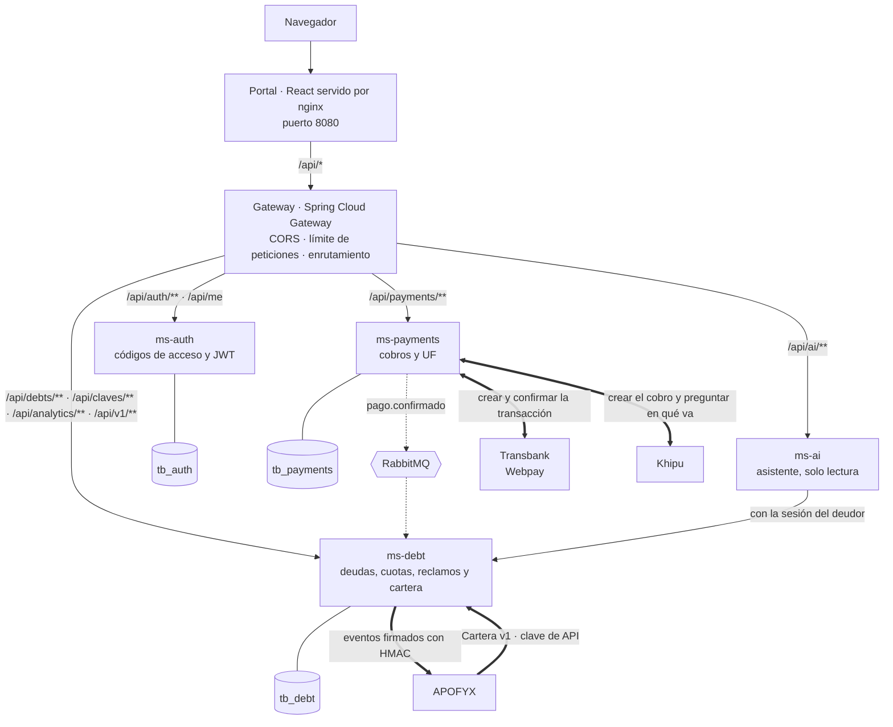
```mermaid
flowchart TD
    N["Navegador"] --> P["Portal · React servido por nginx<br/>puerto 8080"]
    P -->|"/api/*"| G["Gateway · Spring Cloud Gateway<br/>CORS · límite de peticiones · enrutamiento"]

    G -->|"/api/auth/** · /api/me"| A["ms-auth<br/>códigos de acceso y JWT"]
    G -->|"/api/debts/** · /api/claves/** · /api/analytics/** · /api/v1/**"| D["ms-debt<br/>deudas, cuotas, reclamos y cartera"]
    G -->|"/api/payments/**"| Y["ms-payments<br/>cobros y UF"]
    G -->|"/api/ai/**"| I["ms-ai<br/>asistente, solo lectura"]

    A --- BA[("tb_auth")]
    D --- BD[("tb_debt")]
    Y --- BY[("tb_payments")]

    Y -.->|"pago.confirmado"| R{{"RabbitMQ"}}
    R -.-> D
    I -->|"con la sesión del deudor"| D
    Y <==>|"crear y confirmar la transacción"| W["Transbank<br/>Webpay"]
    Y <==>|"crear el cobro y preguntar en qué va"| T["Khipu"]

    AP["APOFYX"] ==>|"Cartera v1 · clave de API"| D
    D ==>|"eventos firmados con HMAC"| AP
```

### Los componentes

| Pieza | Qué hace |
| --- | --- |
| **portal** | React con Zustand y CSS propio. Se compila y lo sirve nginx, que además hace de proxy hacia el gateway: el navegador ve un solo origen y no hay CORS que resolver |
| **gateway** | La única puerta: CORS, límite de peticiones con Bucket4j y enrutamiento. Al retorno de Webpay le quita el `Origin`, porque es la página de Transbank la que devuelve al navegador con un formulario; CORS no se abre a nadie más |
| **ms-auth** | Código de acceso (RUT + 6 caracteres, un solo uso, 24 h) y enlace de respaldo por correo, que es también como entra el personal de las empresas. Emite el JWT, maneja las sesiones y manda los correos, incluido el recordatorio de cuota |
| **ms-debt** | Deudas, cargos y cuotas; convenios de 3 a 24 cuotas; los intereses por mora y del convenio, si el acreedor los pactó; la ejecución de las campañas; reclamos y su resolución; ingesta de la cartera v1 por API o CSV; eventos de vuelta a quien entregó la cartera; resumen para el panel; certificado y comprobantes en PDF; recordatorio de las cuotas por vencer; claves de API de cada empresa |
| **ms-payments** | Los cobros. Webpay contra Transbank, Mercado Pago con Checkout Pro y Khipu (si tiene llave) de verdad; sin credenciales, simulados. El monto lo decide ms-debt, nunca el navegador. En UF fija los pesos al abrir el cobro. Un cobro abandonado se vence: a los 15 minutos en Webpay, a los 30 en Khipu |
| **ms-ai** | Asistente de solo lectura. Lee las deudas con la sesión del deudor, sin acceso propio a la base, y detecta frustración o desconfianza para ajustar el tono. Usa un LLM si hay `XAI_API_KEY` (Grok, con el SDK oficial de OpenAI para Java); si no, o si el LLM falla, responde con reglas |
| **MySQL 8.4** | Una base por servicio, con el esquema versionado en Flyway ([`db/README.md`](db/README.md)) |
| **RabbitMQ** | Lleva el aviso de pago de ms-payments a ms-debt. Si está apagado, el mismo aviso va por HTTP; en los dos casos sale de una bandeja con reintentos, así que no se pierde |

### Cómo está organizado cada servicio

Los tres servicios con base de datos tienen la misma forma, así que quien conoce uno se ubica en
los otros:

```
com/tbridge/<servicio>/
├── config/        seguridad, Swagger, RabbitMQ, cifrado, datos de ejemplo
├── controller/    los endpoints: traducen HTTP y delegan, sin reglas de negocio
├── service/       las reglas de negocio
├── repository/    el acceso a la base (Spring Data JPA)
├── model/         las entidades, una por tabla
├── dto/request/   lo que entra, validado con Bean Validation
├── dto/response/  lo que sale, documentado para Swagger
├── assembler/     los enlaces de HATEOAS de cada recurso
├── client/        las llamadas a otros sistemas (otro servicio, Transbank, Khipu, el Banco Central)
└── exception/     los errores propios del servicio
```

**Cada servicio por sí solo.** No hay un pom padre ni una librería compartida: cada servicio
tiene su `pom.xml` (con Spring Boot como padre y sus propias versiones), su `Dockerfile`, su
workflow y su base, y se compila, se prueba y se despliega sin los demás. Lo que antes estaba en
una librería común lo tiene cada uno en sus paquetes, solo lo que usa: `security/` (verificar el
JWT; ms-auth además lo firma), `exception/` (todos responden `{"error": "..."}` con el código que
corresponde) y `util/` (el RUT y el hash). El aviso de pago (`events/PagoConfirmado`) lo tienen
ms-payments, que lo escribe, y ms-debt, que lo lee, y los dos se prueban contra el mismo contrato:
[`docs/eventos/pago-confirmado.json`](docs/eventos/pago-confirmado.json). El gateway no tiene
base: solo `config/` (las rutas) y `filter/` (el límite de peticiones, la IP real y el retorno de
Webpay). ms-ai tampoco: `controller/`, `service/` (las reglas y el LLM), `client/` (las deudas, que
pide a ms-debt con la sesión del deudor), `dto/` y `exception/`.

**Swagger.** Cada servicio documenta sus endpoints en tres grupos según quién los llama —el
**portal**, el **contrato de integración** y lo **interno**—, y el gateway los junta en una sola
página: http://localhost:8080/swagger-ui.html. El botón *Authorize* recibe el JWT del portal, la
clave de API del contrato o la clave interna.

**HATEOAS.** Las respuestas del portal traen `_links` con lo que se puede hacer después, según el
estado y quién mira:

- una deuda pendiente le ofrece al deudor `simular`, `repactar`, `pagar` y `disputar`;
- a la empresa, `enviar-codigo`, y si la deuda está en reclamo, `resolver-disputa`;
- una deuda pagada ofrece el `certificado`, y un pago su `comprobante`;
- una clave de API vigente, `revocar`.

Los enlaces salen con la dirección pública (`http://localhost:8080/...`) porque cada servicio lee
las cabeceras `X-Forwarded-*` del gateway. El contrato `/api/v1` no lleva enlaces: su forma está
publicada y la leen sistemas de otras empresas.

**Configuración.** Cada servicio tiene `application.properties`, con todo en
`${VARIABLE:valor por omisión}` salvo los secretos, que van como `${VARIABLE}` y sin valor: si
falta uno, el servicio no arranca y dice cuál. `application-dev.properties` es para programar, y
`application-test.properties`, con sus propios valores, para las pruebas.

### Comunicación entre servicios

| Entre quiénes | Cómo | Por qué así |
| --- | --- | --- |
| Navegador → servicios | HTTP por el gateway, con JWT | Una sola puerta que revisar |
| Sistemas de las agencias → ms-debt | HTTP por el gateway (`/api/v1`), con clave de API | Entran por la misma puerta, con su límite de peticiones |
| ms-payments → ms-debt | **RabbitMQ**, cola `ms-debt.pagos-confirmados` | El pago ya ocurrió: si ms-debt está caído, el aviso espera en la cola en vez de perderse |
| ms-debt → ms-auth, ms-payments → ms-debt | HTTP interno con `X-Internal-Key`, fuera del gateway | Son llamadas entre servicios, no de usuarios. El gateway no las expone |
| ms-payments ↔ Transbank | HTTPS con el código de comercio y su llave | Crear la transacción y confirmarla; el navegador solo va y vuelve |
| ms-payments ↔ Khipu | HTTPS con la llave de la cuenta de cobro (`x-api-key`) | Crear el cobro y preguntar en qué va; el navegador solo va y vuelve |
| APOFYX ↔ DataBridge | HTTP con clave de API, y eventos firmados con HMAC-SHA256 | Son empresas distintas: ninguna entra en la base de la otra |

```
Contrato v1, de sistema a sistema (con clave de API):
  APOFYX ── GET /api/v1/cuenta ───────────────────────────────────────────► ms-debt
  APOFYX ── POST /api/v1/carteras, /mandatos, /campanas, /suscripciones ──► ms-debt
  ms-debt ── eventos firmados (pago.confirmado, deuda.disputada, ...) ────► APOFYX

Entre servicios (clave interna, no expuesto por el gateway):
  ms-payments ── /internal/events/pago-confirmado ──► ms-debt
  ms-debt ───── /internal/codigos ──────────────────► ms-auth   (el código y el recordatorio de cuota)
```

**Nada de esto se configura a mano.** La empresa emite la clave de su agencia en *Claves de API*.
La agencia la pega en su panel, y al conectarse comprueba la clave con `GET /api/v1/cuenta` y se
suscribe a los avisos. Un acreedor que DataBridge no conoce **lo registra el mandato** de su
agencia, que trae su RUT, su razón social y su nombre. Solo la agencia, APOFYX, existe desde el
arranque.

El contrato completo, con sus ejemplos y su esquema JSON, está en
[`docs/integracion/`](docs/integracion/README.md).

---

## 7. Modelo de datos

**Una base por servicio**, las tres en el mismo MySQL 8.4. No comparten tablas: si ms-payments
necesita saber cuánto se debe, se lo **pregunta** a ms-debt. Así cada servicio cambia su esquema
sin romper a los demás, y un error en pagos no puede corromper la cartera.

El esquema lo versiona **Flyway**, y cada servicio arranca con `ddl-auto: validate`, que compara
las entidades con las tablas y se niega a partir si no calzan.

| Base | Migraciones |
| --- | --- |
| `tb_debt` | `V1` esquema inicial · `V2` recordatorios · `V3` secreto de las suscripciones, cifrado |
| `tb_auth` | `V1` esquema inicial · `V2` sesiones |
| `tb_payments` | `V1` esquema inicial |

### `tb_debt` — la cartera

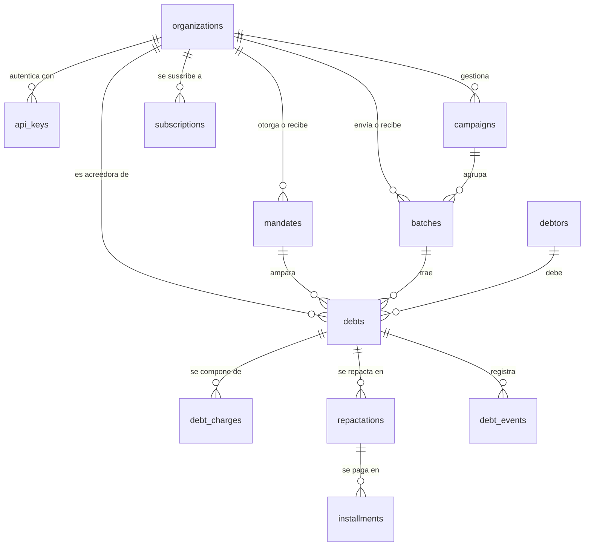
```mermaid
erDiagram
    organizations ||--o{ api_keys    : "autentica con"
    organizations ||--o{ mandates    : "otorga o recibe"
    organizations ||--o{ campaigns   : "gestiona"
    organizations ||--o{ batches     : "envía o recibe"
    organizations ||--o{ debts       : "es acreedora de"
    organizations ||--o{ subscriptions : "se suscribe a"
    campaigns     ||--o{ batches     : "agrupa"
    mandates      ||--o{ debts       : "ampara"
    batches       ||--o{ debts       : "trae"
    debtors       ||--o{ debts       : "debe"
    debts         ||--o{ debt_charges : "se compone de"
    debts         ||--o{ repactations : "se repacta en"
    debts         ||--o{ debt_events  : "registra"
    repactations  ||--o{ installments : "se paga en"
```

Trece tablas y dos vistas (`v_debt_balance`, `v_creditor_portfolio`). Lo que conviene mirar:

- **`organizations`** guarda a los acreedores y a la agencia, con un `kind` que dice cuál es cuál.
  No hay rubro: un acreedor es cualquiera que tenga cobros. Un `mandates` las une: *esta agencia
  cobra por cuenta de este acreedor, desde esta fecha*. Sin mandato vigente, una cartera se
  rechaza.
- **El saldo no se guarda, se calcula.** `debts` tiene sus `debt_charges`, los pagos se anotan
  aparte y el saldo sale de la vista. Así no hay dos números que puedan discrepar.
- **La mora tampoco se guarda.** `debts.interest_rate` es la tasa que pactó el acreedor (vacía, sin
  interés) y la mora se calcula al día. Lo que sí queda escrito es lo que ya se fijó: el interés del
  convenio dentro de cada cuota (`installments.interest_amount`), lo repactado y su tasa
  (`repactations`), y el interés que se cobró en cada pago (`tb_payments.payments.interest_amount`).
- **`debts.status`** es uno de `open`, `repacted`, `disputed`, `paid` o `withdrawn`
  ([§8](#estados-de-una-deuda)). Un reclamo queda en `debt_events` con su motivo y el texto del
  deudor, que no sale de DataBridge.
- **`outbox`** es la bandeja de salida de los eventos, escrita en la misma transacción que el
  hecho que los provoca. Si el sistema se cae entre "cobré" y "avisé", el aviso sigue ahí.
- **`subscriptions.secret`** va **cifrado** ([§9](#9-requisitos-no-funcionales)).

### `tb_auth` — quién entra

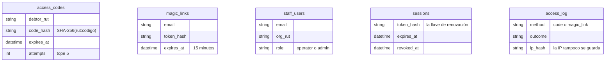
```mermaid
erDiagram
    access_codes {
        string debtor_rut
        string code_hash "SHA-256(rut:codigo)"
        datetime expires_at
        int attempts "tope 5"
    }
    magic_links {
        string email
        string token_hash
        datetime expires_at "15 minutos"
    }
    staff_users {
        string email
        string org_rut
        string role "operator o admin"
    }
    sessions {
        string token_hash "la llave de renovación"
        datetime expires_at
        datetime revoked_at
    }
    access_log {
        string method "code o magic_link"
        string outcome
        string ip_hash "la IP tampoco se guarda"
    }
```

**No hay tabla de usuarios deudores:** el deudor no tiene cuenta. Se guarda el hash del código,
nunca el código; el hash de la llave de renovación, nunca la llave; y en `access_log` el hash de
la IP, nunca la IP.

### `tb_payments` — la plata

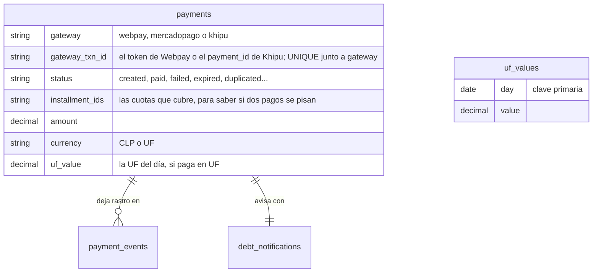
```mermaid
erDiagram
    payments ||--o{ payment_events     : "deja rastro en"
    payments ||--|| debt_notifications : "avisa con"
    payments {
        string gateway "webpay, mercadopago o khipu"
        string gateway_txn_id "el token de Webpay o el payment_id de Khipu; UNIQUE junto a gateway"
        string status "created, paid, failed, expired, duplicated..."
        string installment_ids "las cuotas que cubre, para saber si dos pagos se pisan"
        decimal amount
        string currency "CLP o UF"
        decimal uf_value "la UF del día, si paga en UF"
    }
    uf_values {
        date day "clave primaria"
        decimal value
    }
```

`payments` es **append-only**: un pago no se edita, se le agregan eventos, y lo que respondió la
pasarela (la confirmación de Transbank, o lo que dijo Khipu) queda entero en
`payment_events.gateway_payload`. `UNIQUE (gateway,
gateway_txn_id)` impide cobrar dos veces la misma transacción aunque la pasarela repita el aviso.

---

## 8. Diagramas: las vistas 4+1

La arquitectura se describe con el **modelo 4+1** de Kruchten: cuatro vistas, cada una responde una
pregunta distinta para un lector distinto, y un conjunto de escenarios que las recorre a todas y
las amarra.

| Vista | Qué responde | Para quién | Diagramas |
| --- | --- | --- | --- |
| [**Escenarios** (el +1)](#81-escenarios) | Qué hace cada actor, y qué recorridos prueban la arquitectura | Todos | Casos de uso y escenarios clave |
| [**Lógica**](#82-vista-lógica) | Qué conceptos maneja el sistema y cómo cambian | Quien define el negocio | Clases del dominio y estados de una deuda |
| [**De procesos**](#83-vista-de-procesos) | Qué pasa en el tiempo: quién le habla a quién y qué corre solo | Quien opera y depura | Proceso BPMN *to-be*, flujo de la cartera, secuencia del pago, actividad de la campaña y tareas programadas |
| [**De desarrollo**](#84-vista-de-desarrollo) | Cómo está organizado el código | Quien programa | Módulos y capas |
| [**Física**](#85-vista-física) | Dónde corre cada pieza | Quien despliega | Contenedores, puertos y sistemas externos |

### 8.1 Escenarios

#### Casos de uso

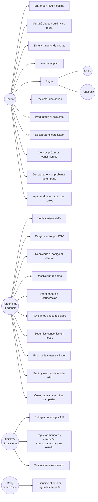
```mermaid
flowchart LR
    DEU(("Deudor"))
    EMP(("Personal de<br/>la agencia"))
    SIS(("APOFYX<br/>otro sistema"))
    KHP(("Khipu"))
    TBK(("Transbank"))
    REL(("Reloj<br/>cada 15 min"))

    DEU --> U1["Entrar con RUT y código"]
    DEU --> U2["Ver qué debe, a quién y su mora"]
    DEU --> U3["Simular un plan de cuotas"]
    DEU --> U4["Aceptar el plan"]
    DEU --> U5["Pagar"]
    DEU --> U22["Reclamar una deuda"]
    DEU --> U6["Preguntarle al asistente"]
    DEU --> U7["Descargar el certificado"]
    DEU --> U15["Ver sus próximos vencimientos"]
    DEU --> U16["Descargar el comprobante de un pago"]
    DEU --> U17["Apagar el recordatorio por correo"]
    U5 --- KHP
    U5 --- TBK

    EMP --> U8["Ver la cartera al día"]
    EMP --> U9["Cargar cartera por CSV"]
    EMP --> U10["Reenviarle el código al deudor"]
    EMP --> U23["Resolver un reclamo"]
    EMP --> U11["Ver el panel de recuperación"]
    EMP --> U18["Revisar los pagos recibidos"]
    EMP --> U19["Seguir los convenios en riesgo"]
    EMP --> U20["Exportar la cartera a Excel"]
    EMP --> U21["Emitir y revocar claves de API"]
    EMP --> U25["Crear, pausar y terminar campañas"]

    SIS --> U12["Entregar cartera por API"]
    SIS --> U13["Registrar mandato y campaña,<br/>con su cadencia y su estado"]
    SIS --> U14["Suscribirse a los eventos"]

    REL --> U24["Escribirle al deudor<br/>según la campaña"]
```

El certificado (`U7`) solo se emite si la deuda está **pagada**: una deuda retirada también queda
en saldo cero, y certificar eso sería decir algo falso.

#### Los escenarios que recorren las cuatro vistas

| Escenario | Lo dispara | Vista lógica | Vista de procesos | Vista física |
| --- | --- | --- | --- | --- |
| **E1. Entregar la cartera** | El acreedor, cada mes | `Batch`, `Debt`, `DebtCharge`, `Mandate` | [Flujo de la cartera](#flujo-la-cartera-de-cada-mes) | APOFYX → portal → gateway → ms-debt |
| **E2. Invitar y recordar** | La deuda que entra, y el reloj | `Campaign`, `DebtEvent` | [Actividad de la campaña](#actividad-cómo-databridge-ejecuta-una-campaña) | ms-debt → ms-auth → correo |
| **E3. Pagar** | El deudor | `Payment`, `Installment` | [Secuencia del pago](#secuencia-el-pago-con-khipu-que-es-la-funcionalidad-principal) | portal → gateway → ms-payments ↔ pasarela, RabbitMQ → ms-debt |
| **E4. Repactar** | El deudor | `Repactation`, `Installment` | [Proceso completo](#el-proceso-completo-en-bpmn-to-be) | portal → gateway → ms-debt |
| **E5. Reclamar** | El deudor; la empresa resuelve | `Debt` en `disputed`, `DebtEvent` | [Estados de una deuda](#estados-de-una-deuda) | portal → gateway → ms-debt → APOFYX |

### 8.2 Vista lógica

#### Clases del dominio

Los conceptos de la cartera viven en ms-debt; el pago, en ms-payments, que nombra la deuda por su
id porque cada servicio tiene su base. El acceso (códigos y sesiones) vive en ms-auth y se
describe en el [modelo de datos](#tb_auth--quién-entra).

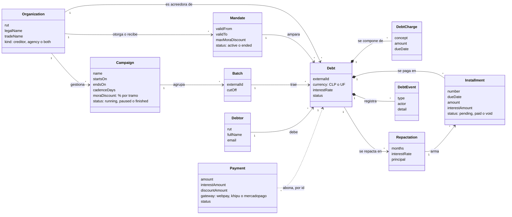
```mermaid
classDiagram
    direction LR
    class Organization {
        rut
        legalName
        tradeName
        kind: creditor, agency o both
    }
    class Mandate {
        validFrom
        validTo
        maxMoraDiscount
        status: active o ended
    }
    class Campaign {
        name
        startsOn
        endsOn
        cadenceDays
        moraDiscount: % por tramo
        status: running, paused o finished
    }
    class Batch {
        externalId
        cutOff
    }
    class Debtor {
        rut
        fullName
        email
    }
    class Debt {
        externalId
        currency: CLP o UF
        interestRate
        status
    }
    class DebtCharge {
        concept
        amount
        dueDate
    }
    class Repactation {
        months
        interestRate
        principal
    }
    class Installment {
        number
        dueDate
        amount
        interestAmount
        status: pending, paid o void
    }
    class DebtEvent {
        type
        actor
        detail
    }
    class Payment {
        amount
        interestAmount
        discountAmount
        gateway: webpay, khipu o mercadopago
        status
    }

    Organization "1" --> "*" Mandate : otorga o recibe
    Organization "1" --> "*" Campaign : gestiona
    Organization "1" --> "*" Debt : es acreedora de
    Mandate "1" --> "*" Debt : ampara
    Campaign "1" --> "*" Batch : agrupa
    Batch "1" --> "*" Debt : trae
    Debtor "1" --> "*" Debt : debe
    Debt "1" *-- "*" DebtCharge : se compone de
    Debt "1" *-- "*" Installment : se paga en
    Debt "1" --> "*" Repactation : se repacta en
    Repactation "1" --> "*" Installment : arma
    Debt "1" *-- "*" DebtEvent : registra
    Payment "*" ..> "1" Debt : abona, por id
```

Lo que se guarda y lo que se calcula: el **saldo** y la **mora** no son atributos, se calculan con
los cargos, las cuotas y la tasa ([§7](#7-modelo-de-datos)). Lo que sí queda escrito es lo que ya se
fijó: el interés de cada cuota del convenio, y el interés y el descuento de cada pago. El descuento
de una campaña nunca pasa del máximo que el acreedor autorizó en el mandato.

#### Estados de una deuda

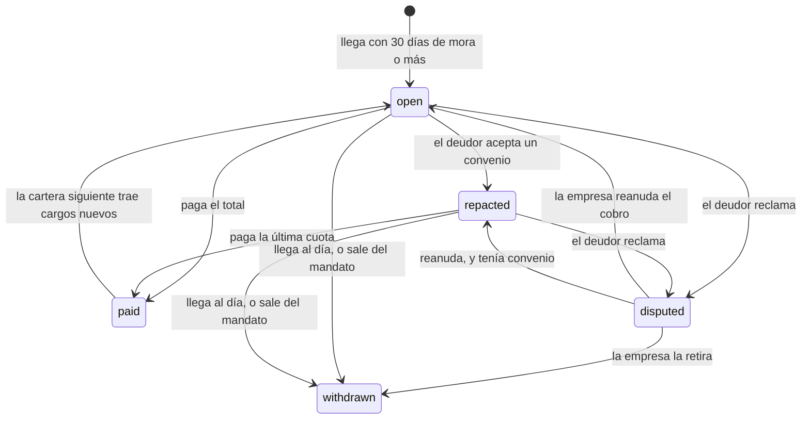
```mermaid
stateDiagram-v2
    [*] --> open: llega con 30 días de mora o más
    open --> repacted: el deudor acepta un convenio
    open --> paid: paga el total
    repacted --> paid: paga la última cuota
    open --> disputed: el deudor reclama
    repacted --> disputed: el deudor reclama
    disputed --> open: la empresa reanuda el cobro
    disputed --> repacted: reanuda, y tenía convenio
    disputed --> withdrawn: la empresa la retira
    open --> withdrawn: llega al día, o sale del mandato
    repacted --> withdrawn: llega al día, o sale del mandato
    paid --> open: la cartera siguiente trae cargos nuevos
```

Cada cambio sale como un evento hacia quien entregó la cartera: `repactacion.aceptada`,
`pago.confirmado`, `deuda.saldada`, `deuda.disputada`, `deuda.reanudada` o `deuda.retirada`.

### 8.3 Vista de procesos

Los diagramas de proceso usan la notación de **BPMN**: cada carril es un participante, el círculo
verde es el inicio, el rojo doble el fin, el rombo una decisión, y la flecha punteada un mensaje
de un sistema a otro.

#### El proceso completo, en BPMN (*to-be*)

Así va una deuda desde que alguien se atrasa hasta que la plata vuelve al acreedor, tal como
funciona hoy:

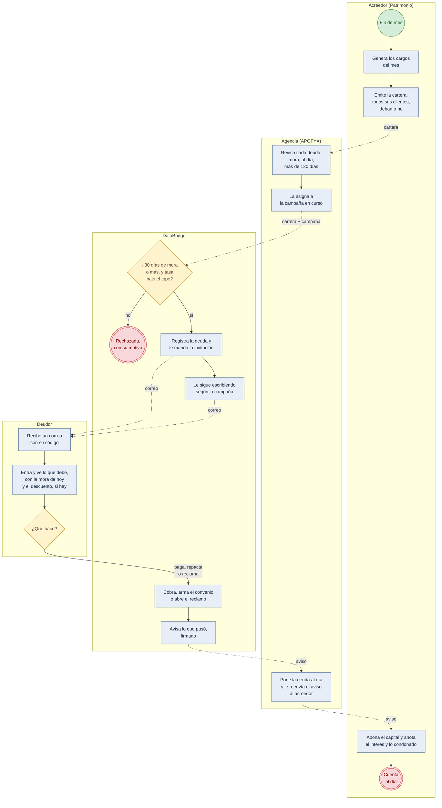
```mermaid
flowchart TB
    classDef inicio fill:#d4edda,stroke:#2e7d32,color:#1b5e20
    classDef fin fill:#f8d7da,stroke:#c62828,color:#7f0000
    classDef decision fill:#fff3cd,stroke:#b8860b,color:#5d4037
    classDef tarea fill:#e8eef7,stroke:#3f5f8a,color:#1a2a40

    subgraph PAT["Acreedor (Patrimonio)"]
        P0(("Fin de mes")):::inicio --> P1["Genera los cargos<br/>del mes"]:::tarea --> P2["Emite la cartera:<br/>todos sus clientes,<br/>deban o no"]:::tarea
        P9["Abona el capital y anota<br/>el interés y lo condonado"]:::tarea --> P10((("Cuenta<br/>al día"))):::fin
    end

    subgraph APX["Agencia (APOFYX)"]
        A1["Revisa cada deuda:<br/>mora, al día,<br/>más de 120 días"]:::tarea --> A2["La asigna a<br/>la campaña en curso"]:::tarea
        A8["Pone la deuda al día<br/>y le reenvía el aviso<br/>al acreedor"]:::tarea
    end

    subgraph DB["DataBridge"]
        D1{"¿30 días de mora<br/>o más, y tasa<br/>bajo el tope?"}:::decision
        D1 -->|no| DX((("Rechazada,<br/>con su motivo"))):::fin
        D1 -->|sí| D2["Registra la deuda y<br/>le manda la invitación"]:::tarea --> D3["Le sigue escribiendo<br/>según la campaña"]:::tarea
        D5["Cobra, arma el convenio<br/>o abre el reclamo"]:::tarea --> D6["Avisa lo que pasó,<br/>firmado"]:::tarea
    end

    subgraph DEU["Deudor"]
        U1["Recibe un correo<br/>con su código"]:::tarea --> U2["Entra y ve lo que debe,<br/>con la mora de hoy<br/>y el descuento, si hay"]:::tarea --> U3{"¿Qué hace?"}:::decision
    end

    P2 -. "cartera" .-> A1
    A2 -. "cartera + campaña" .-> D1
    D2 -. "correo" .-> U1
    D3 -. "correo" .-> U1
    U3 -->|"paga, repacta<br/>o reclama"| D5
    D6 -. "aviso" .-> A8
    A8 -. "aviso" .-> P9
```

| Paso | Quién | Qué pasa |
| --- | --- | --- |
| 1 | Acreedor | A fin de mes genera los cargos y entrega la **cartera**: todos sus clientes con contrato, deban o no, con la tasa de interés de cada uno |
| 2 | APOFYX | Revisa cada deuda (mora, al día, más de 120 días), la asigna a la **campaña** en curso y se la pasa a DataBridge |
| 3 | DataBridge | Acepta las deudas con 30 días de mora o más y una tasa bajo el tope, y le manda al deudor una **invitación**: un código, sin monto ni enlace |
| 4 | DataBridge | Si el deudor no entra ni paga, **le sigue escribiendo** los días de la campaña, dentro de lo que permite la ley |
| 5 | Deudor | Entra con su RUT y el código, ve lo que debe con la mora del día (y el descuento, si la campaña lo trae y paga todo de una vez) y decide: **pagar**, **repactar** o **reclamar** |
| 6 | DataBridge | Cobra con la pasarela, arma el convenio o abre el reclamo, y **avisa** lo que pasó, firmado |
| 7 | APOFYX | Pone su cartera al día y le **reenvía el aviso** al acreedor, firmado por ella |
| 8 | Acreedor | Deja los cargos pagados y anota aparte el interés cobrado y el condonado, sin saber que detrás está DataBridge |

#### Flujo: la cartera de cada mes

Las decisiones que toma cada sistema cuando llega la cartera (el escenario E1):

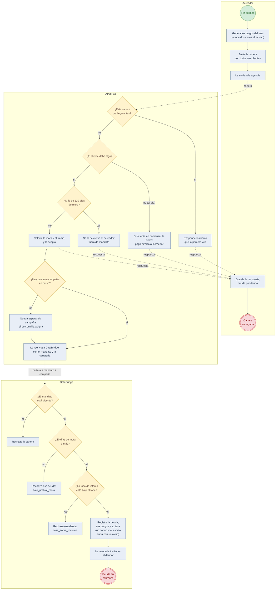
```mermaid
flowchart TB
    classDef inicio fill:#d4edda,stroke:#2e7d32,color:#1b5e20
    classDef fin fill:#f8d7da,stroke:#c62828,color:#7f0000
    classDef decision fill:#fff3cd,stroke:#b8860b,color:#5d4037
    classDef tarea fill:#e8eef7,stroke:#3f5f8a,color:#1a2a40

    subgraph PAT["Acreedor"]
        P0(("Fin de mes")):::inicio --> P1["Genera los cargos del mes<br/>(nunca dos veces el mismo)"]:::tarea
        P1 --> P2["Emite la cartera<br/>con todos sus clientes"]:::tarea
        P2 --> P3["La envía a la agencia"]:::tarea
        P4["Guarda la respuesta,<br/>deuda por deuda"]:::tarea --> P5((("Cartera<br/>entregada"))):::fin
    end

    subgraph APX["APOFYX"]
        A0{"¿Esta cartera<br/>ya llegó antes?"}:::decision
        A0 -->|sí| AR["Responde lo mismo<br/>que la primera vez"]:::tarea
        A0 -->|no| A1{"¿El cliente debe algo?"}:::decision
        A1 -->|"no (al día)"| A2["Si lo tenía en cobranza, la cierra:<br/>pagó directo al acreedor"]:::tarea
        A1 -->|sí| A3{"¿Más de 120 días<br/>de mora?"}:::decision
        A3 -->|sí| A4["Se la devuelve al acreedor:<br/>fuera de mandato"]:::tarea
        A3 -->|no| A5["Calcula la mora y el tramo,<br/>y la acepta"]:::tarea
        A5 --> A6{"¿Hay una sola campaña<br/>en curso?"}:::decision
        A6 -->|no| A7["Queda esperando campaña:<br/>el personal la asigna"]:::tarea
        A6 -->|sí| A8["La reenvía a DataBridge,<br/>con el mandato y la campaña"]:::tarea
        A7 --> A8
    end

    subgraph DB["DataBridge"]
        D0{"¿El mandato<br/>está vigente?"}:::decision
        D0 -->|no| DX["Rechaza la cartera"]:::tarea
        D0 -->|sí| D1{"¿30 días de mora<br/>o más?"}:::decision
        D1 -->|no| D2["Rechaza esa deuda:<br/>bajo_umbral_mora"]:::tarea
        D1 -->|sí| D3{"¿La tasa de interés<br/>está bajo el tope?"}:::decision
        D3 -->|no| D4["Rechaza esa deuda:<br/>tasa_sobre_maxima"]:::tarea
        D3 -->|sí| D5["Registra la deuda,<br/>sus cargos y su tasa<br/>(un correo mal escrito<br/>entra con un aviso)"]:::tarea
        D5 --> D6["Le manda la invitación<br/>al deudor"]:::tarea
        D6 --> D7((("Deuda en<br/>cobranza"))):::fin
    end

    P3 -. "cartera" .-> A0
    A8 -. "cartera + mandato + campaña" .-> D0
    AR -. "respuesta" .-> P4
    A2 -. "respuesta" .-> P4
    A4 -. "respuesta" .-> P4
    A5 -. "respuesta" .-> P4
```

#### Secuencia: el pago con Khipu, que es la funcionalidad principal

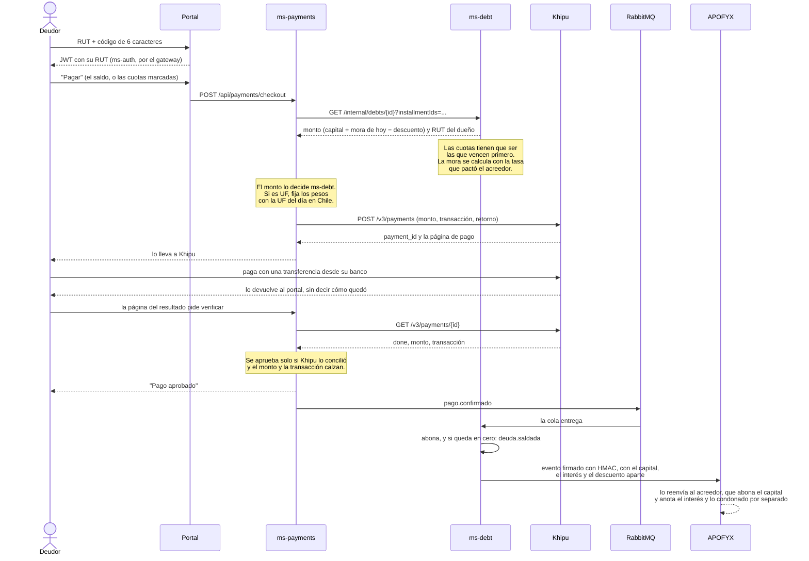
```mermaid
sequenceDiagram
    actor D as Deudor
    participant P as Portal
    participant Y as ms-payments
    participant M as ms-debt
    participant K as Khipu
    participant R as RabbitMQ
    participant X as APOFYX

    D->>P: RUT + código de 6 caracteres
    P-->>D: JWT con su RUT (ms-auth, por el gateway)

    D->>P: "Pagar" (el saldo, o las cuotas marcadas)
    P->>Y: POST /api/payments/checkout
    Y->>M: GET /internal/debts/{id}?installmentIds=...
    M-->>Y: monto (capital + mora de hoy − descuento) y RUT del dueño
    Note over M: Las cuotas tienen que ser<br/>las que vencen primero.<br/>La mora se calcula con la tasa<br/>que pactó el acreedor.
    Note over Y: El monto lo decide ms-debt.<br/>Si es UF, fija los pesos<br/>con la UF del día en Chile.
    Y->>K: POST /v3/payments (monto, transacción, retorno)
    K-->>Y: payment_id y la página de pago
    Y-->>D: lo lleva a Khipu

    D->>K: paga con una transferencia desde su banco
    K-->>D: lo devuelve al portal, sin decir cómo quedó
    D->>Y: la página del resultado pide verificar
    Y->>K: GET /v3/payments/{id}
    K-->>Y: done, monto, transacción
    Note over Y: Se aprueba solo si Khipu lo concilió<br/>y el monto y la transacción calzan.
    Y-->>D: "Pago aprobado"

    Y->>R: pago.confirmado
    R->>M: la cola entrega
    M->>M: abona, y si queda en cero: deuda.saldada
    M->>X: evento firmado con HMAC, con el capital,<br/>el interés y el descuento aparte
    X-->>X: lo reenvía al acreedor, que abona el capital<br/>y anota el interés y lo condonado por separado
```

**El navegador nunca dice cuánto hay que pagar ni si el pago salió bien.** El monto lo pregunta
ms-payments a ms-debt, y la aprobación la confirma ms-payments con Khipu, de servidor a servidor.
Si el deudor cierra la ventana antes de volver, el pago igual se registra: ms-payments le pregunta
a Khipu por los cobros abiertos cada 10 segundos.

**Mientras la pasarela verifica, nadie paga dos veces ni se pierde un pago.** Entre que el deudor
transfiere y que Khipu lo confirma pasa un rato, y en ese rato la cuota todavía se ve pendiente.

- **Un pago a la vez por deuda.** Al abrir un pago, ms-payments mira los otros pagos abiertos de esa
  deuda. Si uno está en verificación (Khipu `verifying`, Mercado Pago `in_process` o `pending`), el
  nuevo se rechaza: *Tienes un pago en verificación*. Si uno quedó abierto sin pagar, se anula en
  la pasarela (Khipu lo borra y la preferencia de Mercado Pago vence en el acto) y queda vencido.
- **Cada pago guarda las cuotas que cubre**, tal como las cobró ms-debt. Una cuota ya pagada que
  ms-debt todavía no abona no se vuelve a cobrar.
- **Si igual se paga dos veces** (Webpay no se puede anular: solo cobra si ms-payments confirma la
  transacción al volver el deudor), el segundo pago queda `duplicated`. No se abona, y la empresa
  lo ve en *Pagos recibidos*, en *Pagos para devolver*, con el RUT del deudor y la referencia de la
  pasarela para devolverlo.
- **No se vence lo que se está verificando.** Si el plazo se cumple mientras la pasarela verifica,
  el pago sigue abierto hasta que se confirme. Un cobro que vence sin pagarse se anula en Khipu.
- **Los vencidos se revisan un día más.** Cada 5 minutos, ms-payments pregunta por los cobros que
  vencieron en las últimas 24 horas. En Khipu, un intento empezado justo antes del vencimiento
  tiene hasta 3 horas para terminar: si alguno aparece pagado, se registra igual. El aviso de
  Khipu también lo registra.

**Con Webpay es igual, con otra forma:** ms-payments abre la transacción en Transbank y lleva al
deudor a Webpay con un formulario POST. Cuando Webpay lo devuelve, ms-payments confirma la
transacción con Transbank (`PUT /transactions/{token}`) antes de mostrarle el resultado. Se aprueba
solo con `AUTHORIZED`, código de respuesta 0, el monto cobrado y la orden de compra de ese pago. El
aviso de vuelta tampoco pasa por el navegador.

#### Actividad: cómo DataBridge ejecuta una campaña

Cada 15 minutos, DataBridge recorre las campañas en curso y, para cada deuda, decide si le toca un
correo:

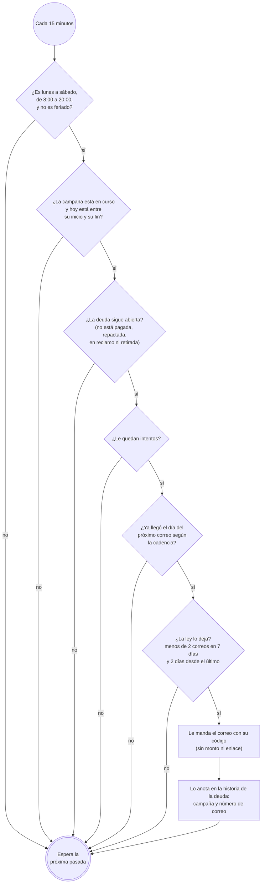
```mermaid
flowchart TD
    I(("Cada 15 minutos")) --> H{"¿Es lunes a sábado,<br/>de 8:00 a 20:00,<br/>y no es feriado?"}
    H -->|no| F((("Espera la<br/>próxima pasada")))
    H -->|sí| C{"¿La campaña está en curso<br/>y hoy está entre<br/>su inicio y su fin?"}
    C -->|no| F
    C -->|sí| D{"¿La deuda sigue abierta?<br/>(no está pagada, repactada,<br/>en reclamo ni retirada)"}
    D -->|no| F
    D -->|sí| N{"¿Le quedan intentos?"}
    N -->|no| F
    N -->|sí| T{"¿Ya llegó el día del<br/>próximo correo según<br/>la cadencia?"}
    T -->|no| F
    T -->|sí| L{"¿La ley lo deja?<br/>menos de 2 correos en 7 días<br/>y 2 días desde el último"}
    L -->|no| F
    L -->|sí| E["Le manda el correo con su código<br/>(sin monto ni enlace)"]
    E --> R["Lo anota en la historia de la deuda:<br/>campaña y número de correo"]
    R --> F
```

Un correo que esperó no se pierde: en la pasada siguiente se vuelve a preguntar, y sale en cuanto
la ley lo deja.

#### Lo que corre solo

Además de responder peticiones, cada servicio tiene tareas programadas. Ninguna depende de que
haya alguien mirando, y las que avisan a otro sistema escriben primero en una bandeja de salida,
así que un sistema caído no pierde nada:

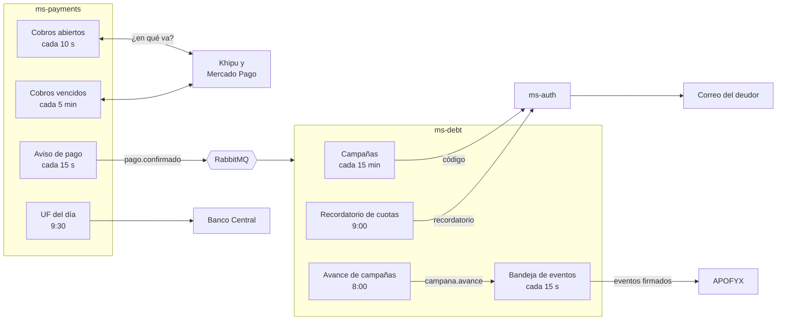
```mermaid
flowchart LR
    subgraph DEBT["ms-debt"]
        C1["Campañas<br/>cada 15 min"]
        C2["Recordatorio de cuotas<br/>9:00"]
        C3["Avance de campañas<br/>8:00"]
        C4["Bandeja de eventos<br/>cada 15 s"]
    end
    subgraph PAY["ms-payments"]
        P1["Cobros abiertos<br/>cada 10 s"]
        P2["Cobros vencidos<br/>cada 5 min"]
        P3["Aviso de pago<br/>cada 15 s"]
        P4["UF del día<br/>9:30"]
    end
    AUTH["ms-auth"] --> MAIL["Correo del deudor"]
    C1 -->|"código"| AUTH
    C2 -->|"recordatorio"| AUTH
    C3 -->|"campana.avance"| C4
    C4 -->|"eventos firmados"| APX["APOFYX"]
    P1 <-->|"¿en qué va?"| GW["Khipu y<br/>Mercado Pago"]
    P2 <--> GW
    P3 -->|"pago.confirmado"| MQ{{"RabbitMQ"}}
    MQ --> DEBT
    P4 --> BC["Banco Central"]
```

| Tarea | Servicio | Cuándo | Qué hace |
| --- | --- | --- | --- |
| Campañas | ms-debt | Cada 15 minutos | Manda los correos que tocan según la cadencia, dentro del horario y el límite de la ley |
| Recordatorio de cuotas | ms-debt | Todos los días, 9:00 | Avisa las cuotas que vencen en 3 días (`RECORDATORIO_DIAS_ANTES`) |
| Avance de campañas | ms-debt | Todos los días, 8:00 | Publica `campana.avance`: cuántos correos salieron, cuántos entraron al portal, repactaron, pagaron o reclamaron, y cuánto se recuperó |
| Bandeja de eventos | ms-debt | Cada 15 segundos | Entrega los eventos pendientes a cada suscriptor, firmados, con reintentos |
| Cobros abiertos | ms-payments | Cada 10 segundos | Pregunta a Khipu y a Mercado Pago en qué van los cobros abiertos |
| Cobros vencidos | ms-payments | Cada 5 minutos | Vence lo abandonado (también en Webpay) y revisa por 24 horas lo que venció |
| Aviso de pago | ms-payments | Cada 15 segundos | Lleva `pago.confirmado` a ms-debt por RabbitMQ, o por HTTP si RabbitMQ no está |
| UF del día | ms-payments | Todos los días, 9:30 | Trae la UF del Banco Central, para fijar los pesos de las deudas en UF |

### 8.4 Vista de desarrollo

Un solo repositorio con dos lenguajes: Java en los servicios y JavaScript en el portal. **Cada
servicio es un proyecto de Maven aparte**, con Spring Boot como padre: no hay un pom padre del
repositorio ni una librería compartida. Lo único que comparten es lo publicado: el contrato y el
aviso de pago.

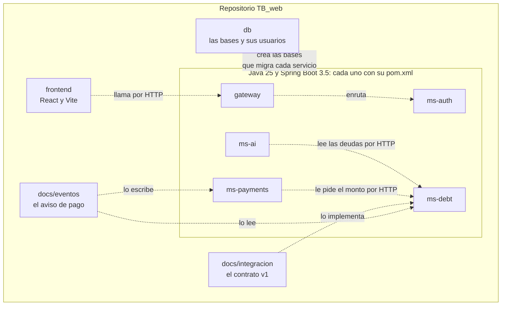
```mermaid
flowchart TB
    subgraph REPO["Repositorio TB_web"]
        subgraph JAVA["Java 25 y Spring Boot 3.5: cada uno con su pom.xml"]
            AUTH["ms-auth"]
            DEBT["ms-debt"]
            PAY["ms-payments"]
            AI["ms-ai"]
            GWY["gateway"]
        end
        FE["frontend<br/>React y Vite"]
        DOCS["docs/integracion<br/>el contrato v1"]
        EVT["docs/eventos<br/>el aviso de pago"]
        DBD["db<br/>las bases y sus usuarios"]
    end
    FE -. "llama por HTTP" .-> GWY
    GWY -. "enruta" .-> AUTH
    AI -. "lee las deudas por HTTP" .-> DEBT
    PAY -. "le pide el monto por HTTP" .-> DEBT
    DOCS -. "lo implementa" .-> DEBT
    EVT -. "lo escribe" .-> PAY
    EVT -. "lo lee" .-> DEBT
    DBD -. "crea las bases<br/>que migra cada servicio" .-> JAVA
```

Dentro de cada servicio, las mismas capas, de afuera hacia adentro (el detalle de cada carpeta está
en [§6](#cómo-está-organizado-cada-servicio)):

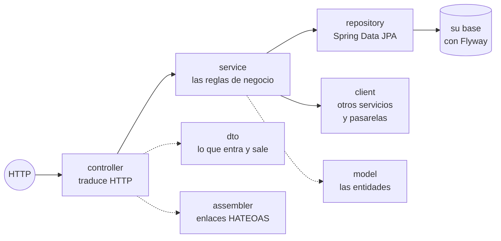
```mermaid
flowchart LR
    HTTP(("HTTP")) --> CTRL["controller<br/>traduce HTTP"]
    CTRL --> SRV["service<br/>las reglas de negocio"]
    SRV --> REP["repository<br/>Spring Data JPA"]
    REP --> BASE[("su base<br/>con Flyway")]
    SRV --> CLI["client<br/>otros servicios<br/>y pasarelas"]
    CTRL -.-> DTO["dto<br/>lo que entra y sale"]
    CTRL -.-> ASM["assembler<br/>enlaces HATEOAS"]
    SRV -.-> MOD["model<br/>las entidades"]
```

Una regla las ordena: **el controller traduce y delega, y las reglas viven en el service**. Por eso
las reglas se prueban sin levantar el servidor web, con los repositorios simulados, y la capa web
se prueba sin base de datos ([§11](#11-pruebas)).

### 8.5 Vista física

Todo corre en contenedores de Docker, en un solo equipo. Solo el portal se publica para el
navegador; los servicios se hablan por la red interna de Docker:

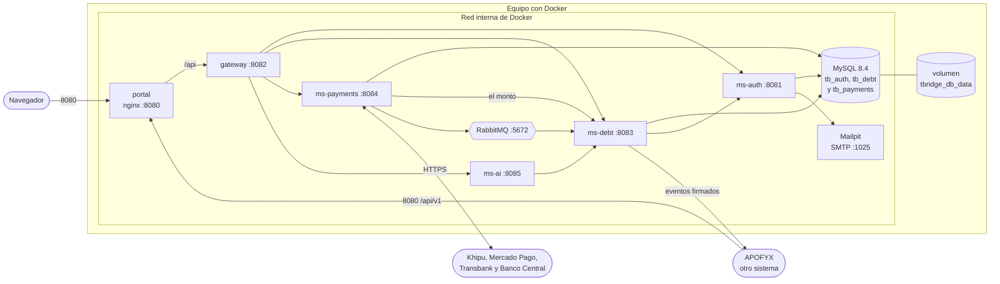
```mermaid
flowchart LR
    NAV(["Navegador"])
    APX(["APOFYX<br/>otro sistema"])
    subgraph HOST["Equipo con Docker"]
        subgraph RED["Red interna de Docker"]
            PORTAL["portal<br/>nginx :8080"]
            GW["gateway :8082"]
            AUTH["ms-auth :8081"]
            DEBT["ms-debt :8083"]
            PAY["ms-payments :8084"]
            AI["ms-ai :8085"]
            MYSQL[("MySQL 8.4<br/>tb_auth, tb_debt<br/>y tb_payments")]
            MQ{{"RabbitMQ :5672"}}
            MAIL["Mailpit<br/>SMTP :1025"]
        end
        VOL[("volumen<br/>tbridge_db_data")]
    end
    EXT(["Khipu, Mercado Pago,<br/>Transbank y Banco Central"])

    NAV -->|"8080"| PORTAL
    APX -->|"8080 /api/v1"| PORTAL
    PORTAL -->|"/api"| GW
    GW --> AUTH
    GW --> DEBT
    GW --> PAY
    GW --> AI
    AUTH --> MYSQL
    DEBT --> MYSQL
    PAY --> MYSQL
    MYSQL --- VOL
    PAY -->|"el monto"| DEBT
    PAY --> MQ
    MQ --> DEBT
    DEBT --> AUTH
    AUTH --> MAIL
    AI --> DEBT
    PAY <-->|"HTTPS"| EXT
    DEBT -->|"eventos firmados"| APX
```

| Contenedor | Puerto interno | Publicado en el equipo | Para qué |
| --- | --- | --- | --- |
| `portal` | 8080 | **8080** | La única puerta: el portal y `/api` hacia el gateway |
| `gateway` | 8082 | — | Enruta, limita peticiones y revisa CORS |
| `ms-auth` · `ms-debt` · `ms-payments` · `ms-ai` | 8081 · 8083 · 8084 · 8085 | — | Solo los ve el gateway y entre ellos |
| `mysql` | 3306 | 3308 | Para revisar la base desde el equipo |
| `rabbitmq` | 5672 · 15672 | 5672 · 15672 | La cola y su consola |
| `mailpit` | 1025 · 8025 | 1025 · 8025 | El buzón de prueba y su página |

Los puertos publicados se cambian desde `.env` ([§3](#si-algo-falla-en-un-equipo-nuevo)). En un
despliegue real, cada servicio puede ir en su propio nodo detrás del gateway, con las salvedades de
[§9](#9-requisitos-no-funcionales).

---

## 9. Requisitos no funcionales

| Requisito | Cómo se cumple | Dónde está |
| --- | --- | --- |
| **Seguridad** · autenticación | El deudor entra con RUT + 6 caracteres, sin cuenta ni contraseña. Un solo uso, 24 h, 5 intentos. El alfabeto excluye `0 O 1 I L` porque el código se dicta por teléfono | `ms-auth/AuthService` |
| **Seguridad** · sesión | El JWT dura **15 minutos** y vive en la memoria de la pestaña, no en `localStorage`. Mantiene a la persona adentro una llave de renovación de 256 bits en una cookie `HttpOnly` y `SameSite=Strict`, que ningún script puede leer. Cada uso la cambia por otra; cerrar sesión la revoca **en el servidor**, y si una llave usada reaparece, se revoca toda la sesión | `ms-auth/SessionService`, `V2__sesiones.sql` |
| **Seguridad** · origen | Cada freno cuenta por IP, así que la IP no se puede inventar: nginx sobrescribe `X-Forwarded-For`, y el gateway solo les cree a sus proxies (`TRUSTED_PROXIES`). CORS acepta solo los orígenes del portal (`CORS_ORIGINS`), no `*` | `frontend/nginx.conf`, `gateway/ClienteReal` |
| **Seguridad** · secretos | Lo que solo se compara se guarda como hash: códigos, tokens de enlace, llaves de renovación y claves de API. Lo que hay que leer de vuelta —el secreto con que se firman los avisos— va **cifrado con AES-256-GCM**, con una llave fuera de la base (`CIFRADO_LLAVE`). Un secreto en claro de antes se cifra solo al arrancar | `ms-debt/config/Cifrado`, `V3__secretos_cifrados.sql` |
| **Seguridad** · pagos | Nada de lo que traiga el navegador se aplica: ms-payments le pregunta a la pasarela. Un pago de Webpay se aprueba solo si Transbank confirma `AUTHORIZED` con código 0 **y** el monto y la orden calzan; un retorno repetido no se vuelve a confirmar. Uno de Khipu, solo si Khipu dice que está conciliado (`done`, sin reversa) **y** el monto y la transacción calzan; su aviso se verifica con firma HMAC. Un pago real no se puede confirmar por el camino de la simulación | `ms-payments/PaymentService`, `WebpayClient`, `KhipuClient`, `FirmaDeKhipu` |
| **Seguridad** · enlace | El enlace de respaldo va **solo al correo que registró el acreedor** para ese RUT (ms-auth se lo pregunta a ms-debt con la clave interna); el que se escribe no se usa, y el deudor lo pide solo con su RUT. Al personal le llega solo si su cuenta está habilitada. Si ms-debt no responde, no sale nada. Un enlace pedido con RUT abre solo la sesión de ese deudor, y la bitácora anota si el correo salió o no | `AuthService.pedirEnlace`, `DeudasClient`, `V3__enlace_pedido.sql` |
| **Seguridad** · enumeración | "No hay código" y "código incorrecto" responden **lo mismo**, para que nadie averigüe qué RUT tienen deuda. Pedir un enlace también responde siempre lo mismo, salga o no el correo, y el correo sale en segundo plano para que tampoco lo delate el tiempo de respuesta | `AuthService.entrarConCodigo`, `AuthService.pedirEnlace` |
| **Seguridad** · autorización | Cada sesión se identifica por RUT. Un deudor ve, paga y reclama solo lo suyo; una agencia ve y resuelve solo la cartera de su mandato | `DebtService`, `DisputaService` |
| **Seguridad** · integridad | Los eventos van firmados con HMAC-SHA256, caducan a los 5 minutos y se descartan si llegan repetidos | `docs/integracion/README.md` §8 |
| **Privacidad** | Ningún evento lleva datos personales del deudor. El texto que escribe al reclamar se queda en DataBridge: a la cadena viaja solo el motivo | `EventosService`, decisión I5 del contrato |
| **Seguridad** · superficie | De la aplicación, **solo el portal publica un puerto**. MySQL, RabbitMQ y el buzón publican el suyo **a propósito**, para revisarlos en desarrollo; en un despliegue real esas líneas `ports:` se borran | `docker-compose.yml` |
| **Seguridad** · contenedores | Ninguna imagen corre como root: los servicios usan el usuario `10001` y el portal la nginx sin privilegios. Las imágenes de Java llevan solo el JRE, sin compilador ni código fuente | `*/Dockerfile` |
| **Seguridad** · entradas | Cada petición entra como un tipo con sus reglas (`@NotBlank`, `@Size`, `@Pattern`...), y lo que no cumple se responde con `400` y un mensaje para la persona. Un JSON mal escrito o una ruta que no existe responden `400` y `404`, no `500` | `dto/request/`, `common/ApiExceptionHandler` |
| **Rendimiento** · medido | Con 100 personas a la vez, **cero errores** en unas 32.000 peticiones y un p95 de 7 a 12 ms según el día. En estrés, holgado hasta 1.000 peticiones por segundo; **toca techo en unas 1.800**, donde se pone lento pero no falla. Mediciones del 23 y 24 de septiembre, con máquina y detalle en [`rendimiento/`](rendimiento/README.md) | `rendimiento/` |
| **Rendimiento** · límite de peticiones | Dos capas: el gateway deja 10 por minuto en `/api/auth/**` y 120 globales por IP, y `ms-auth` bloquea diez minutos al origen que falla diez códigos | `gateway/RateLimitFilter`, `AuthService` |
| **Rendimiento** · consultas | Índices para los caminos que se usan: `ix_debt_creditor_status` (la cartera de un acreedor), `ix_debt_debtor` (lo que debe una persona). `uq_payment_gateway` evita cobrar dos veces la misma transacción y además es el índice con que se busca el retorno de Webpay y el aviso de Khipu | `V1__esquema_inicial.sql` |
| **Rendimiento** · memoria | La JVM lee el límite del contenedor (`MaxRAMPercentage=75`), y cada servicio tiene su tope declarado | `*/Dockerfile` |
| **Rendimiento** · portal | La página de la empresa, la de los gráficos, se carga de forma diferida: el JS principal pesa 320 kB y el de esa página 420 kB, antes de gzip | `frontend/src/App.jsx` |
| **Usabilidad** | Tema claro (crema y verde bosque) y oscuro (carbón y morado), que sigue al del sistema hasta que la persona elige. Quien pidió menos movimiento no ve animaciones. La barra de estado se anuncia como barra de progreso a los lectores de pantalla | `frontend/src/index.css` |
| **Disponibilidad** | Los nueve contenedores declaran `healthcheck`, y ninguno arranca antes que aquel del que depende. La salud la da Actuator, que incluye la conexión a la base. `restart: unless-stopped` los repone si se caen | `docker-compose.yml` |
| **Disponibilidad** · entrega | Todo lo que sale hacia otro sistema pasa por una bandeja con reintentos (1 min, 5 min, 30 min, 2 h, 6 h, 24 h). Si APOFYX está caído, el aviso se entrega cuando vuelve | `outbox`, `EventDispatcher` |
| **Escalabilidad** | La identidad viaja en JWT y las sesiones se guardan en `tb_auth`. Para varias réplicas falta coordinar dos cosas: los límites del gateway viven en la memoria de cada instancia, y las tareas programadas (recordatorios, despachadores, vencimiento de pagos) correrían en cada una. No se validó con varias instancias | `RateLimitFilter`, `EventDispatcher`, `ConciliacionPasarelas`, `WebpayVencidos` |
| **Portabilidad** | Una orden levanta el sistema entero en cualquier máquina con Docker | `docker-compose.yml` |
| **Mantenibilidad** | Los tres servicios tienen la misma estructura de paquetes. `ddl-auto: validate` se niega a arrancar si las entidades y las tablas no calzan | `application.properties` |
| **Documentación** | Todos los endpoints en Swagger, con sus respuestas posibles y ejemplos reales | http://localhost:8080/swagger-ui.html |

---

## 10. Docker

### Qué se construye

| Imagen | Con qué |
| --- | --- |
| `tbridge/ms-auth` · `tbridge/ms-debt` · `tbridge/ms-payments` · `tbridge/ms-ai` · `tbridge/gateway` | Un Dockerfile por servicio: [`ms-auth`](ms-auth/Dockerfile), [`ms-debt`](ms-debt/Dockerfile), [`ms-payments`](ms-payments/Dockerfile), [`ms-ai`](ms-ai/Dockerfile), [`gateway`](gateway/Dockerfile) |
| `tbridge/portal` | [`frontend/Dockerfile`](frontend/Dockerfile): compila con Node y sirve con nginx |

Cada servicio de Java se construye desde su propia carpeta, con su `pom.xml` y su código, sin
nada de los demás:

```powershell
docker build -t tbridge/ms-debt ms-debt
```

Son **dos etapas**: la primera compila con Maven y el JDK, y la segunda se queda solo con el JRE y
el `.jar`. Las dependencias de Maven quedan en un caché de Docker entre construcciones.

El [`docker-compose.yml`](docker-compose.yml) orquesta los nueve contenedores. Sin perfil levanta
solo la infraestructura (MySQL, RabbitMQ y el buzón); con `--profile app`, el sistema entero.

### Variables de entorno

Van en un archivo `.env` al lado del `docker-compose.yml`, que no se sube al repositorio.
[`.env.example`](.env.example) las trae todas, comentadas, y `preparar-env.ps1` crea el `.env`
desde él. El mismo `.env` lo leen los servicios cuando se corren con Maven.

**Los secretos no tienen valor por omisión** (los marcados *el `.env`*): el repositorio es
público, y un valor escrito aquí lo podría leer cualquiera. El script los genera al azar. Lo que
no es secreto sí tiene un valor de desarrollo.

| Variable | Por omisión | Para qué |
| --- | --- | --- |
| `PORTAL_PORT`, `MYSQL_PORT`, `RABBIT_PORT`, `RABBIT_ADMIN_PORT`, `MAILPIT_SMTP_PORT`, `MAILPIT_PORT` | `8080`, `3308`, `5672`, `15672`, `1025`, `8025` | Los puertos que se publican en el equipo. Se cambian si alguno ya está ocupado |
| `PUBLIC_URL` | `http://localhost:8080` | La dirección del portal que va en los correos y en el retorno de Webpay y de Khipu |
| `MYSQL_USER` | `tbridge` | El usuario de la base para los servicios |
| `MYSQL_PASSWORD`, `MYSQL_ROOT_PASSWORD` | el `.env` | Las claves de la base. Una vez creada la base, se cambian con `preparar-env.ps1 -Renovar`, que las cambia también dentro de MySQL |
| `RABBIT_USER` | `guest` | El usuario de RabbitMQ |
| `RABBIT_PASSWORD` | el `.env` | Su clave |
| `JWT_SECRET` | el `.env` | Firma los JWT. **El mismo en ms-auth, ms-debt y ms-payments.** Al menos 32 bytes: con menos, los servicios no arrancan |
| `INTERNAL_KEY` | el `.env` | Autentica las llamadas entre servicios |
| `CIFRADO_LLAVE` | el `.env` | Cifra en la base el secreto de las suscripciones. Si se cambia, los suscritos tienen que volver a suscribirse |
| `JWT_TTL_MINUTES` | `15` | Cuánto dura el JWT. Corto a propósito: no se puede revocar |
| `REFRESH_TTL_HOURS` | `168` | Cuánto dura una sesión desde que se entra. Renovar no la alarga |
| `COOKIE_SECURE` | `false` | **Encender detrás de HTTPS.** Una cookie `Secure` sobre HTTP el navegador la descarta sin avisar |
| `CODE_TTL_HOURS`, `MAGIC_TTL_MINUTES` | `24`, `15` | Cuánto dura el código de acceso del deudor, y el enlace de respaldo |
| `MAIL_FROM` | `noreply@technicalbridge.local` | El remitente de los correos. En Docker los correos van al buzón de prueba; `SMTP_*` son solo para correr ms-auth con Maven |
| `CORS_ORIGINS` | los del portal | Qué orígenes pueden hacer peticiones con credenciales al gateway |
| `TRUSTED_PROXIES` | local y las redes privadas (`10.x`, `172.16–31`, `192.168.x`) | En qué proxies confía el gateway para saber la IP del cliente. No puede quedar vacía |
| `WEBHOOK_SECRET` | el `.env` | Firma los enlaces de pago y verifica los avisos de las pasarelas simuladas |
| `TRANSBANK_ENVIRONMENT` | `TEST` | `TEST` cobra contra el ambiente de integración de Transbank; `SIMULADA`, sin internet, vuelve a la pasarela simulada |
| `TRANSBANK_API_URL`, `TRANSBANK_COMMERCE_CODE`, `TRANSBANK_API_KEY` | los públicos de integración | Los únicos con un valor escrito: Transbank los publica para todos en su documentación, para probar. En producción, los del comercio van solo en el `.env` |
| `TRANSBANK_VENCE_EN` | según el ambiente | Cuánto vale un cobro de Webpay. Vacía, lo que da Transbank: 15 minutos en integración (5 de token y 10 de formulario) y 9 en producción |
| `KHIPU_LLAVE` | vacía | La llave de API de una cuenta de cobro de Khipu. Con ella, Khipu cobra de verdad; vacía, es simulada. **Es un secreto: solo en el `.env`** |
| `KHIPU_URL_AVISOS`, `KHIPU_SECRETO` | vacías | Con una dirección pública de DataBridge: dónde avisa Khipu, y el secreto con que se verifica su firma |
| `KHIPU_VENCE_EN` | `30m` | Cuándo se vence un cobro de Khipu que nadie pagó |
| `MERCADOPAGO_ACCESS_TOKEN`, `MERCADOPAGO_PUBLIC_KEY` | vacías | Las credenciales de una cuenta de Mercado Pago. Con ellas, Mercado Pago cobra de verdad; vacías, es simulada. **El token es un secreto: solo en el `.env`** |
| `MERCADOPAGO_ENVIRONMENT`, `MERCADOPAGO_URL` | `TEST`, `https://api.mercadopago.com` | `TEST` con credenciales de prueba, `PRODUCCION` con las reales, `SIMULADA` sin internet |
| `MERCADOPAGO_VENCE_EN` | `30m` | Cuándo vence un cobro de Mercado Pago que nadie pagó: la preferencia expira a esa hora y el pago queda vencido |
| `BCENTRAL_USER`, `BCENTRAL_PASS` | vacías | La UF del Banco Central. Sin ellas, se carga a mano |
| `XAI_API_KEY` | vacía | El LLM del asistente. Sin ella, responde con reglas |
| `XAI_BASE_URL`, `XAI_MODEL` | `https://api.x.ai/v1`, `grok-4.5` | El proveedor y el modelo del LLM |
| `MIN_DIAS_MORA` | `30` | Desde cuántos días de mora del cargo impago más antiguo entra una deuda a cobranza |
| `RECORDATORIO_DIAS_ANTES` | `3` | Cuántos días antes de cada cuota llega el recordatorio. Nunca se repite para la misma cuota |
| `INTERES_TASA_MAXIMA_MENSUAL` | `3.0` | El tope de la tasa que pacta el acreedor, en % mensual: la tasa máxima convencional vigente. Una deuda con una tasa mayor se rechaza (`tasa_sobre_maxima`) |
| `CONTACTO_FERIADOS` | vacía | Los feriados que se decretan y no se pueden calcular (una elección, un plebiscito, un feriado especial), separados por coma. Se suman a los nacionales, que se calculan solos para cualquier año. Las campañas no contactan esos días |
| `DEMO_DATOS` | `true` | Carga al arrancar la cartera de ejemplo. Solo agrega lo que falte: una base con datos propios no pierde nada |
| `RATE_AUTH_CAPACITY`, `RATE_GLOBAL_CAPACITY` | `10` / `120` | Peticiones por minuto |
| `EVENTS_RABBIT` | `true` en Docker, `false` con Maven | Si el aviso de pago va por RabbitMQ o por HTTP. En Docker está fijo en `true` |
| `SWAGGER_ENABLED` | `true` | Apagar la documentación, por ejemplo en producción |

**Los valores por omisión son de desarrollo y están escritos en un archivo público: no sirven
para nada que no sea una demostración.**

---

## 11. Pruebas

```powershell
.\mvnw.cmd -f ms-debt\pom.xml clean test                        # un servicio (lo mismo con gateway, ms-auth, ms-payments o ms-ai)
foreach ($s in "gateway","ms-auth","ms-debt","ms-payments","ms-ai") { .\mvnw.cmd -q -f "$s\pom.xml" clean test }   # los cinco
```

En GitHub cada módulo tiene su propio workflow (`gateway`, `ms-auth`, `ms-debt`, `ms-payments`,
`frontend`, `ms-ai`), que prueba solo si cambió su carpeta y deja en el resumen cuántas pruebas
pasaron, clase por clase. Los de Java comparten [`java.yml`](.github/workflows/java.yml). Todos
con permisos de solo lectura y con cada acción externa fijada a un commit exacto.

**`main` está protegida.** Nadie sube directo: todo entra por un PR, se mergea con squash y solo si
pasan los seis checks `CI de <módulo>`. En un PR cada workflow corre siempre, pero si su carpeta no
cambió se salta las pruebas y su check pasa en segundos. Así un PR que solo cambia el README no
espera pruebas que nunca van a correr.

Cada servicio tiene sus pruebas en `src/test/java`, con la misma estructura de paquetes que el
código. **Ninguna necesita base de datos ni internet**, así que corren en segundos en cualquier
equipo: Transbank y Khipu se reemplazan por un servidor HTTP local.

> Usa `clean`. El editor de VS Code compila por su cuenta dentro de `target/`, y sin `clean`
> Maven puede dar por buena una clase vieja.

| Tipo | Qué cubre |
| --- | --- |
| **Unitarias** (JUnit 5 + Mockito) | Las reglas de cada servicio con los repositorios simulados. Que cada quien vea solo lo suyo; que el monto salga de ms-debt y no del navegador; que un pago avisado dos veces se abone una; que las cuotas se paguen en orden; que solo entren deudores morosos; que un cliente al día cierre lo que estaba en cobranza; que el mandato registre al acreedor nuevo; que un convenio sobreviva al mes siguiente; el reclamo y sus dos resoluciones; el cifrado y que un secreto viejo se cifre al arrancar; la sesión revocable, el código de acceso, la UF, la firma de los eventos y el recordatorio |
| **De Webpay** | El cliente contra un Transbank falso: crear, confirmar, consultar y sus errores, sin que el detalle de Transbank ni la llave lleguen a la persona; el plazo según el ambiente. El retorno aprobado; rechazado, sin código, con otro monto o con otra orden; anulado, con error de formulario y por tiempo; repetido; con Transbank caído; con un token ajeno. La página que manda el token una sola vez. La consulta periódica: el pago sin confirmar que se confirma, el confirmado que se registra, el fallido, reversado o anulado, el que sigue abierto, el que vence pasado el plazo y el que vence si Transbank no contesta en un día. Al abrir otro cobro, el anterior pagado se registra y frena el nuevo, y el anterior sin pagar se vence |
| **De seguridad de las pasarelas** | La página de Webpay escapa lo que muestra; con la firma de otro pago no se abre ni se gasta el token; una vuelta por tiempo con una sesión inventada no hace fallar el cobro de otro; la respuesta del cobro no muestra el token; un cobro vencido que se pagó no se confirma (para no cobrar dos veces); la consulta no acepta otro monto ni otra orden; la vuelta, la página y la consulta bloquean la fila del pago, y entre la consulta y la vuelta se confirma una sola vez |
| **De las pasarelas lentas o caídas** | Webpay, Khipu, Mercado Pago y ms-debt, contra un servidor que tarda más que el tiempo máximo y contra un puerto donde no escucha nadie: cada cliente corta en menos de dos segundos, sin mostrar el detalle técnico |
| **De Mercado Pago** | El cliente contra un Mercado Pago falso: la preferencia con el token, la vuelta (con `auto_return` solo si es https) y el `init_point`, y sus errores; la preferencia vence a la hora pedida. La conciliación por las órdenes de la preferencia, también la periódica que vence lo abandonado: sin pagos, con un pago aprobado (también después de una tarjeta rechazada), con una tarjeta rechazada que deja el cobro abierto para reintentar, con Mercado Pago caído o con una preferencia que no existe; la vuelta y el aviso, sin sesión |
| **De Khipu** | El cliente contra un Khipu falso: crear el cobro, preguntar en qué va y sus errores. El pago conciliado, el que sigue en verificación, el rechazado, el revertido y el arrepentido (con el cobro anulado en Khipu, o pagado justo antes de anularlo); que otro monto u otra transacción no se aprueben; que un pago real no se confirme por la simulación; la consulta periódica que cierra lo pagado y vence lo abandonado, y la firma de los avisos |
| **Del doble pago** | Un segundo pago mientras otro se verifica se rechaza; el abierto sin pagar se anula (Khipu lo borra, la preferencia de Mercado Pago vence en el acto) y queda vencido; una cuota pagada que ms-debt todavía no abona no se cobra de nuevo; el cobro guarda las cuotas que cubre, y ms-debt las informa en orden. Si igual se paga dos veces, el segundo queda `duplicated`, sin abonar y con la referencia y el RUT para devolverlo; pagar otras cuotas de la misma deuda no es duplicado. La consulta periódica no vence lo que Khipu o Mercado Pago están verificando y anula en Khipu lo que vence; un vencido que se paga después se registra, por la revisión de vencidos o por el aviso de Khipu |
| **De los intereses** | La mora de cada cargo atrasado desde el día siguiente a su vencimiento, con lo pagado imputado a lo más antiguo; la cuota del convenio que crece solo sobre su capital; el redondeo en pesos y en UF; el convenio en sistema francés, con la última cuota que absorbe el redondeo; que sin tasa todo quede como antes; que el cobro fije el capital y el interés y el aviso los lleve separados; la tasa que no es un número o que supera el tope |
| **De las campañas** | Que cada recordatorio salga el día que dice la cadencia y no antes; los intentos, las fechas y el estado de la campaña; que pare con el pago, el convenio, el reclamo o el retiro; el horario, el domingo y el feriado; los feriados calculados contra los publicados (2023, 2026 y 2027 completos, y cada regla contra un año real: el 2 de enero, el 17 y el 20 de septiembre, los que se corren al lunes, el 31 de octubre y el solsticio al minuto); el límite de dos por semana con dos días entre uno y otro, que frena también la invitación, el recordatorio de cuota y el reenvío del código; el estado que manda APOFYX; el acreedor que cobra sin agencia: registra, pausa y termina su campaña sin mandato, no puede registrar la de otro, sus carteras (JSON y planilla) la nombran en el lote, y el avance le llega a él; desde el portal, solo una empresa ve y cambia sus campañas, sin un id DataBridge le pone uno, cambiar el estado no pisa el nombre ni el inicio, y se rechazan la cadencia que no crece o trae ceros, los intentos fuera de 1 a 10, el fin antes del inicio y un id de más de 64 caracteres |
| **Del descuento por pronto pago** | El tramo por los días del cargo impago más antiguo (30, 31, 62, 100 y 150 días); el % de la campaña recortado al máximo vigente del mandato, que baja si el acreedor lo baja; sin máximo, con el mandato vencido, con la campaña pausada o fuera de sus fechas, nada; el acreedor sin agencia se autoriza hasta 100. El mandato guarda su máximo y lo cambia al reenviarse; la campaña rechaza un tramo que no existe o un valor fuera de 0 a 100 (`descuento_invalido`) y uno sobre el máximo (`descuento_sobre_tope`), y `{}` le quita el descuento. Al cobrar: el ejemplo del contrato ($900.000 + $18.800 − $9.400 = $909.400), sin descuento en un pago de parte de la deuda ni en convenio, la oferta que ve el deudor con su fecha, el descuento fijo en ms-payments desde que se abre el cobro, y el aviso que lo lleva hasta el acreedor, también cuando se condona toda la mora |
| **Del asistente** | Las reglas: los montos en pesos y en UF sin sumarlos entre sí, el ánimo (la desconfianza pesa más que la cortesía) y el tono de cada respuesta. El LLM contra un servidor falso con la forma de la API de xAI: responde con la API de Responses, usa la de chat si no la hay, y si falla o contesta en blanco responde con las reglas; viajan los últimos doce mensajes. Las deudas se piden con la sesión del deudor, y si ms-debt dice que no o no responde, el asistente sigue sin deudas. Arranca solo y publica su salud y su Swagger |
| **De la capa web** (`@WebMvcTest` + MockMvc) | Cada controlador con su seguridad, su validación y su JSON: `401` sin sesión, `403` con la deuda de otro, `400` con datos malos, los `_links` según quién mira, la cookie de la sesión y los nombres del contrato v1 intactos. El aviso de Khipu llega con el cuerpo tal como vino, porque sobre ese texto va la firma. En el gateway, que el retorno de Webpay pase sin `Origin` y nada más |
| **Del contrato del aviso de pago** | ms-payments manda exactamente el ejemplo de [`docs/eventos/pago-confirmado.json`](docs/eventos/pago-confirmado.json), por el exchange y la clave que dice; ms-debt escucha en esa cola y entiende cada campo; un mensaje no puede elegir qué clase se crea al leerlo |
| **De seguridad** | **CodeQL** (Java y JavaScript) en cada pull request y cada semana; la auditoría de dependencias del portal, que rompe su workflow ante una vulnerabilidad alta; Dependabot por módulo, también para las acciones de GitHub; y el escaneo de secretos de GitHub con protección de push, que rechaza un push que traiga un token conocido |
| **De rendimiento** (k6) | Cómo lo siente una persona, dónde está el techo y cuánto aguanta abrir cobros (`pagos.js`, solo con las pasarelas simuladas). Se corren a mano, con el sistema arriba ([`rendimiento/`](rendimiento/README.md)) |

**561 pruebas**, todas en Java y sin fallos:

| Módulo | Pruebas |
| --- | --- |
| `gateway` | 13 |
| `ms-auth` | 68 |
| `ms-debt` | 275 |
| `ms-payments` | 172 |
| `ms-ai` | 33 |

Además, la cadena completa con los tres sistemas se prueba de punta a punta con un script que
vive fuera de este repositorio, en la carpeta que reúne a los tres
([estado](#estado-al-6-de-octubre-de-2026)).

---

## 12. Innovación

**¿Qué problema resuelve?** Está en [§1](#qué-problema-resuelve): cobrar deudas chicas cuesta más
que la deuda, y el deudor que quiere pagar se topa con un horario de oficina.

**¿Qué hace diferente a la solución?**

1. **Se entra sin cuenta.** El deudor no crea un usuario ni inventa una contraseña: escribe su RUT
   y el código que le llegó. Una cuenta más es una razón más para no pagar, y una base de
   contraseñas más que se puede filtrar.
2. **Tres empresas, un contrato.** El acreedor, la agencia y la plataforma de pago son sistemas
   independientes que se hablan por un contrato versionado, no por una base compartida. Sumar una
   empresa no toca código: se registra en su agencia, entrega su cartera y el mandato la presenta
   a DataBridge. Si un sistema se cae, los demás siguen funcionando.
3. **Todo vuelve al acreedor.** Lo difícil de la cobranza tercerizada no es cobrar: es que el
   acreedor se entere. Acá el pago viaja de vuelta, firmado, hasta dejar la deuda en $0 en su
   sistema; y un reclamo también, para que nadie le siga cobrando a quien dice que ya pagó
   mientras se revisa.

**¿Qué valor agrega?** Al acreedor, cobranza de montos bajos que antes no era rentable, y certeza
de que su cartera está al día. Al deudor, pagar a cualquier hora, ver el detalle de lo que debe,
repactar en cuotas y reclamar sin llamar a nadie. A la agencia, una cartera que se actualiza
sola.

---

## Recorrido de demostración

1. **La cartera llega por API o por archivo.** APOFYX la entrega con `POST /api/v1/carteras` (en
   Swagger: *Deudas - contrato de integracion v1*); quien no tiene integración arrastra el CSV
   del contrato al portal. Las dos entradas usan la misma ingesta.
2. **La empresa entra.** En *Soy de una empresa*, `camila.reyes@apofyx.cl` pide su enlace, que
   llega al buzón. Ve la cartera que APOFYX entregó, aunque el acreedor sea otro.
3. **El deudor recibe su código solo.** Al entrar la deuda, la invitación sale a su correo, y la
   cartera muestra *Invitado el …*. La pantalla no muestra el código: quien lo viera podría entrar
   en su lugar.
4. **El deudor entra** con su RUT y ese código. Puede simular un plan, aceptarlo y pagar una o
   varias cuotas, en orden.
5. **O reclama.** *No reconozco esta deuda*, con un motivo y, si quiere, un detalle. La deuda queda
   **En revisión**. La empresa la ve con el filtro del mismo nombre, y toca **Reanudar cobro** o
   **Retirar**.
6. **Paga con Webpay**, con la [tarjeta de prueba](#para-pagar-con-webpay), en la página real de
   Transbank; o con Khipu, con el banco de prueba ([cómo activarlo](#para-pagar-con-khipu-de-verdad)).
7. **Todo vuelve por la cadena.** ms-payments avisa a ms-debt, ms-debt emite los eventos, y APOFYX
   y el acreedor los reciben.
8. **Queda el rastro.** El deudor ve el pago en su historial, con qué cuotas cubrió, y descarga el
   comprobante. La empresa lo ve en *Pagos recibidos*.

**Las marcas de las pasarelas.** Webpay, Mercado Pago y Khipu aparecen con su logo oficial, tal
como Transbank, Mercado Pago y Khipu los publican para los comercios, porque es lo que el deudor
reconoce. Los logos son marcas de sus dueños. Las simuladas lo dicen en pantalla: *Simulación*.

**Pagos en UF.** Usan la UF de ese día exacto, del **Banco Central**. Como la publica con un mes
de adelanto, ms-payments la carga al arrancar y cada mañana a las 9:30. Sin credenciales, se carga
a mano:

```powershell
$cuerpo = @{ dia = "2026-10-03"; valor = "39876.54" } | ConvertTo-Json
$cuerpo | docker compose --profile app exec -T ms-payments sh -c 'curl -s -X POST http://127.0.0.1:8084/internal/uf -H X-Internal-Key:$INTERNAL_KEY -H Content-Type:application/json --data-binary @-'
```

---

## Estado al 6 de octubre de 2026

| Verificación | Resultado |
| --- | --- |
| Pruebas Java (cada servicio con su `mvnw -f <servicio>\pom.xml clean test`, JDK 25) | **561**, sin fallos |
| Asistente en Java | Antes de borrar la versión en Python se compararon las dos: 1148 comparaciones de las reglas, sin diferencias. En vivo, por el gateway y con la sesión de tres deudores, 30 de 30 respuestas iguales. En Edge, el deudor conversa con el asistente en tema claro y oscuro, en escritorio y en celular |
| Webpay | Contra el ambiente de integración de Transbank, con los contenedores reconstruidos y en Edge: el deudor anula en Webpay y el portal dice *El pago no se completó*; paga con la tarjeta de prueba y vuelve con *Pago aprobado*, el pago queda `paid` con la respuesta `AUTHORIZED` guardada, y el contrato de Patrimonio queda con lo que corresponde |
| Build del portal | Correcto, 754 módulos |
| Cadena completa, sobre los contenedores reconstruidos | **16 de 16** comprobaciones: el cliente moroso nuevo llega desde Patrimonio, DataBridge registra al acreedor y lo invita, el deudor reclama y la disputa llega al acreedor, la agencia reanuda, el pago vuelve hasta el contrato y un lote repetido no se procesa dos veces |
| Khipu | Contra un Khipu falso con la forma de la API v3, con los contenedores reconstruidos y en Edge: el deudor se arrepiente y el portal dice *El pago no se completó*; paga y dice *Pago aprobado*; paga y cierra la ventana sin volver, y la consulta periódica lo registra sola. En los tres casos el contrato de Patrimonio queda con lo que corresponde. Y contra **Khipu real**, con una cuenta en modo desarrollador: se pagó con DemoBank, Khipu lo concilió (4 min 20 s desde que se abrió el cobro, contando lo que tarda la persona en Khipu) y ms-payments lo registró 21 s después, cuando todavía revisaba cada 30 s Al cancelar, el cobro se anula en Khipu: probado contra Khipu real, donde queda `deleted` y ya no se puede pagar |
| Mercado Pago | Contra el Mercado Pago real con credenciales de prueba, con ms-payments reconstruido y en Edge: la preferencia se crea con vencimiento a 30 minutos; el deudor paga con la tarjeta de prueba y no vuelve al portal, y la consulta periódica registra el pago en unos 10 s: queda `paid` y la deuda del contrato en Patrimonio baja a $0 |
| Doble pago | Contra las pasarelas reales, con la migración `V2` aplicada sobre la base con datos: mientras Khipu verifica, otro pago por la misma cuota se rechaza (*Tienes un pago en verificación*); recién pagada la cuota, antes de que ms-debt la abone, también; un cobro de Khipu abierto sin pagar queda `deleted` en Khipu y vencido aquí al abrir otro, y la preferencia de Mercado Pago vence en el acto. Pagados a la vez un cobro de Webpay y uno de Khipu por la misma cuota, el primero se abona y el segundo queda `duplicated`: la deuda baja una sola vez, el deudor ve *Estas cuotas ya estaban pagadas* y la empresa lo ve en *Pagos para devolver* con la referencia de Khipu |
| Webpay según Transbank ([#75](https://github.com/TechnicalBridge/TB_web/issues/75)) | En Edge contra el ambiente de integración, con ms-payments y el portal reconstruidos: 11 de 11 comprobaciones. La página abierta dos veces dice *Webpay ya se abrió* en vez del Error 21, y la primera ventana paga igual; una vuelta por tiempo con una sesión inventada responde 400 y no toca el cobro; *Abrirla de nuevo* abre un cobro nuevo y vence el anterior; **pagado y sin volver al portal, ms-payments lo confirmó solo en 7 segundos**, y la Mastercard de prueba queda rechazada. El cobro que había quedado abierto por el Error 21 se venció solo, después de consultarlo |
| Carga de pagos (`rendimiento/pagos.js`) | Con las pasarelas simuladas, hasta 100 deudores abriendo cobros a la vez: 5.817 peticiones sin una falla, abrir un cobro en 30 ms y consultarlo en 7 ms (p95) |
| Reclamo en pantalla | Recorrido en Edge: el deudor reclama, la empresa lo ve con su detalle y lo retira, y el acreedor ve *Disputa aceptada* |
| Interés por mora | Con los tres sistemas reconstruidos y Khipu real: un contrato de Patrimonio al 2% mensual, con tres arriendos de $300.000 atrasados 62, 31 y 1 día, llegó por APOFYX con su tasa. El portal mostró $18.800 de mora, se pagaron $918.800 con Khipu, y Patrimonio dejó los cargos en $0 y anotó $18.800 de intereses |
| Convenio con interés | Otro contrato, al 1,5%, repactó $914.100 (capital más mora) en 6 cuotas de $160.448, la última de $160.445: $962.685 en total, $48.585 de intereses del convenio |
| Campaña | Creada en APOFYX con la cadencia 1, 4, 11 y 3 intentos, y avanzada día por día con la pasada de prueba. Salieron la invitación el martes 6 de octubre, el primer recordatorio el 8 y el segundo el 13. No salió nada el 7 ni el 10 (el límite de la ley), el domingo 11, el feriado del 12 ni el 13 a las 7:30. Pausada en APOFYX, el 20 no salió nada. Tres correos en total, en Mailpit |
| Pantallas de intereses y campañas | En Edge: el formulario de campaña de APOFYX pide la cadencia y ofrece solo correo, y pausar o reanudar llega a DataBridge; el deudor ve su mora y a qué tasa, el convenio con su interés y el pago desglosado; Patrimonio muestra la tasa del contrato, el interés cobrado y el campo al firmar |
| Campañas en el portal ([#78](https://github.com/TechnicalBridge/TB_web/issues/78)) | En Edge como la empresa, con ms-debt y el portal reconstruidos: 31 de 31 comprobaciones. Una campaña para Patrimonio, creada sin id, recibe uno de DataBridge; la cadencia que no crece o trae ceros y los intentos fuera de 1 a 10 no dejan crear, y la de 1, 2, 5 muestra la advertencia de la ley. La campaña aparece en *Cargar* y una deuda de prueba entra con ella: pausada, la pasada no le envía nada, y reanudada le escribe. Cambiarla no pisa el inicio ni el estado, y terminada ya no ofrece nada ni contacta. La campaña de otra empresa responde 404. En los dos temas, a 1440, 390 y 360 px, sin scroll horizontal |
| `main` protegida | En los tres repositorios, un push directo a `main` se rechaza (*GH013: Changes must be made through a pull request*): solo entra un PR, con squash y con la CI en verde. En TB_web, un PR que solo cambia el README pasa los seis checks `CI de <módulo>` sin correr las pruebas |
| Descuento por pronto pago ([#45](https://github.com/TechnicalBridge/TB_web/issues/45)) | En Edge, con ms-debt, ms-payments y el portal reconstruidos y las migraciones `V5` aplicadas en las dos bases: el acreedor autoriza hasta 100% en el mandato, la empresa crea en el portal una campaña con 0/50/100 y carga tres arriendos de $300.000 al 2% atrasados 62, 31 y 1 día. El deudor ve *te descontamos $9.400… Pagarías $909.400 en vez de $918.800*, paga $909.400 con Webpay (tarjeta de prueba) y queda registrado en todos lados: el pago con $9.400 de interés y $9.400 de descuento, la deuda saldada, `pago.confirmado` con su desglose, el historial, *Pagos recibidos* y el comprobante en PDF. En los dos temas, a 1440, 390 y 360 px |
| Migraciones sobre una base con datos | `V3` aplicada y el secreto existente cifrado al arrancar |

**Lo que no está:**

- **Mercado Pago, la vuelta al portal:** Mercado Pago descarta las direcciones de vuelta que no
  son https, así que en local el deudor no vuelve solo al portal. El pago se registra igual, por la
  consulta periódica. La vuelta automática con un túnel https no se probó.
- **WhatsApp y SMS:** el contrato admite los canales, pero los códigos y las campañas salen solo
  por correo, y APOFYX ya no los ofrece al crear una campaña.
- **La tasa máxima convencional se pone a mano** (`INTERES_TASA_MAXIMA_MENSUAL`): la CMF la publica
  cada mes y no se trae sola.
- **Los feriados que se decretan se suman a mano** (`CONTACTO_FERIADOS`): una elección, un
  plebiscito o un feriado especial no se pueden calcular. Los nacionales se calculan solos para
  cualquier año. Los regionales (el 7 de junio en Arica y Parinacota, el 20 de agosto en Chillán y
  Chillán Viejo) no están, porque DataBridge no sabe en qué región vive el deudor.
- **Que el deudor pida que no lo contacten más**, y los gastos de cobranza que permite el art. 37,
  no están.
- **Varias réplicas:** ver *Escalabilidad* en [§9](#9-requisitos-no-funcionales).
- **Retención de datos** (decisión I12 del contrato): cuánto se guarda una deuda saldada antes de
  anonimizarla.
- **El frontend no tiene una suite automática:** se prueba compilando y recorriendo en el
  navegador.
- **Los roles del equipo** en [§4](#4-integrantes-del-equipo).

---

Este repositorio es una de tres piezas:
[**Patrimonio Inmuebles**](https://github.com/TechnicalBridge/patrimonioinmuebles) →
[**APOFYX**](https://github.com/TechnicalBridge/APOFYX) → **DataBridge**.
